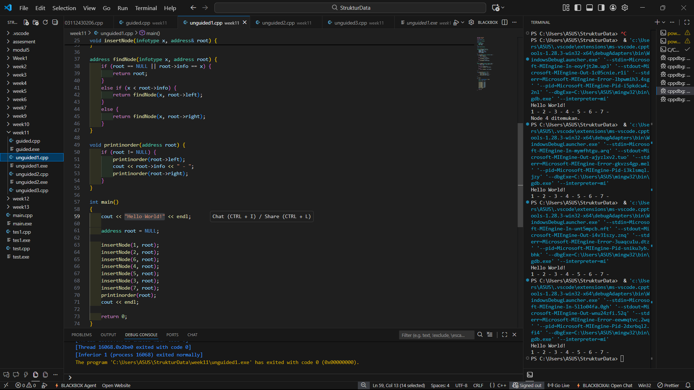

# <h1 align="center">Laporan Praktikum Modul 10 <br> Tree</h1>
<p align="center">DENNA WAHYU SETYOBUDI - 103112430206</p>

## Dasar Teori

Pada materi ini menjelaskan tentang Tree. Tree adalah struktur data hierarkis yang digunakan untuk mengatur dan merepresentasikan data dalam hubungan induk-anak .
Tree terdiri dari simpul-simpul, dengan simpul teratas disebut akar , dan setiap simpul lainnya dapat memiliki satu atau lebih simpul anak .

## Guided

### soal 1

```go
#include <iostream>
using namespace std;

struct Node {
   int data;
   Node *kiri, *kanan;
};

// bikin node baru
Node *membuat_node(int data) {
   Node *node_baru = new Node();
   node_baru->data = data;  
   node_baru->kiri = node_baru->kanan = NULL;
   return node_baru;
}

Node *insert(Node *root, int nilai) {
   if (root == NULL) {
      return membuat_node(nilai);
   }
   if (nilai < root->data) {
      // rekursif ke kiri
      root->kiri = insert(root->kiri, nilai);
   }
   else if (nilai > root->data) {
      // rekursif ke kanan
      root->kanan = insert(root->kanan, nilai);
   }

   return root;   // mengembalikan root agar struktur tetap utuh
}

Node *search(Node *root, int nilai) {
   if (root == NULL || root->data == nilai) {
      return root;  
   }
   if (nilai < root->data) {
      return search(root->kiri, nilai);   
   }
   return search(root->kanan, nilai);     
}

Node *nilai_terkecil(Node *root) {
   Node *sekarang = root;
   while (sekarang && sekarang->kiri != NULL) {
      sekarang = sekarang->kiri;   // geser terus ke kiri buat cari nilai paling kecil
   }
   return sekarang; 
}

Node *hapus(Node *root, int nilai) {
   if (root == NULL) {
      return root;  
   }
   if (nilai < root->data) {
      root->kiri = hapus(root->kiri, nilai);   // hapus dari subtree kiri
   } else if (nilai > root->data) {
      root->kanan = hapus(root->kanan, nilai); // hapus dari subtree kanan
   } else {
      if (root->kiri == NULL) {
         Node *sementara = root->kanan;
         delete root;        
         return sementara;   
      }
      else if (root->kanan == NULL) {
         Node *sementara = root->kiri;
         delete root;        
         return sementara;   
      }
      Node *sementara = nilai_terkecil(root->kanan);
      root->data = sementara->data;     
      root->kanan = hapus(root->kanan, sementara->data); 
   }
   return root;  
}

Node *update(Node *root, int lama, int baru) {
   if (search(root, lama) != NULL) {
      root = hapus(root, lama);   
      root = insert(root, baru);  
      cout << "data " << lama << " diganti jadi " << baru << endl;
   }
   else {
      cout << "data " << lama << " ngga ketemu" << endl;
   }
   return root;
}


void pre_order(Node *root) {
   if (root != NULL) {
      cout << root->data << " ";   
      pre_order(root->kiri);       
      pre_order(root->kanan);      
   }
}

void in_order(Node *root) {
   if (root != NULL) {
      in_order(root->kiri);         
      cout << root->data << " ";    
      in_order(root->kanan);        
   }
}

void post_order(Node *root) {
   if (root != NULL) {
      post_order(root->kiri);     
      post_order(root->kanan);    
      cout << root->data << " ";  // tampilkan data paling terakhir
   }
}

int main() {
   Node *root = NULL;

   cout << "=== 1. insert data ===" << endl;
   root = insert(root, 10);
   insert(root, 5);
   insert(root, 20);
   insert(root, 3);
   insert(root, 7);
   insert(root, 15);
   insert(root, 25);
   cout << "data berhasil dimasukkan!" << endl;

   cout << "\n=== 2. traversal tree ===" << endl;
   cout << "pre-order : ";
   pre_order(root);
   cout << endl;
   cout << "in-order  : ";
   in_order(root);
   cout << endl;
   cout << "post-order: ";
   post_order(root);
   cout << endl;

   cout << "\n=== 3. search data ===" << endl;
   int cari1 = 7, cari2 = 99;
   cout << "mencari " << cari1 << ": " << (search(root, cari1) ? "ketemu" : "ngga ketemu") << endl;
   cout << "mencari " << cari2 << ": " << (search(root, cari2) ? "ketemu" : "ngga ketemu") << endl;
   cout << endl;

   cout << "=== 4. update data ===" << endl;
   root = update(root, 5, 8);
   cout << "in-order setelah update: ";
   in_order(root);  
   cout << endl;

   cout << "pre-order : ";
   pre_order(root);
   cout << endl;
   cout << "in-order  : ";
   in_order(root);
   cout << endl;
   cout << "post-order: ";
   post_order(root);
   cout << endl;

   cout << "\n=== 5. delete data ===" << endl;
   cout << "menghapus 20" << endl;
   root = hapus(root, 20);

   cout << "pre-order : ";
   pre_order(root);
   cout << endl;
   cout << "in-order  : ";
   in_order(root);
   cout << endl;
   cout << "post-order: ";
   post_order(root);
   cout << endl;
   return 0;
}
```
> Output
> 

Pada perogram diatas kita harus mengimplementasikan Abstract Data Type (ADT) Binary Search Tree (BST),Kita membuat sebuah struct Node yang berisi data, pointer kekiri dan kanan. buat fungsi fungsi yaitu membuat_node,insert,search,nilai_terkecil,hapus,update,pre_order,in_order dan post_order

Lalu kita buat fungsi main nya kita buat root kosong lalu kita issert data dummy dan menjalankan semua fungsi yang ada

## Unguided

### Soal 1

```go
#include <iostream>
#include <string>

using namespace std;

typedef int infotype;

struct Node {
    infotype info;
    Node* left;
    Node* right;
};

typedef Node* address;


address alokasi(infotype x) {
    address newNode = new Node;
    newNode->info = x;
    newNode->left = NULL;
    newNode->right = NULL;
    return newNode;
}

void insertNode(infotype x, address& root) {
    if (root == NULL) {
        root = alokasi(x);
    }
    else if (x < root->info) {
        insertNode(x, root->left);
    }
    else if (x > root->info) {
        insertNode(x, root->right);
    }
}

address findNode(infotype x, address root) {
    if (root == NULL || root->info == x) {
        return root;
    } 
    else if (x < root->info) {
        return findNode(x, root->left);
    } 
    else { 
        return findNode(x, root->right);
    }
}

void printinorder(address root) {
    if (root != NULL) {
        printinorder(root->left);
        cout << root->info << " - ";
        printinorder(root->right);
    }
}

int main()
{
    cout << "Hello World!" << endl;
    
    address root = NULL;

    insertNode(1, root);
    insertNode(2, root);
    insertNode(6, root);
    insertNode(4, root);
    insertNode(5, root);
    insertNode(3, root);
    insertNode(7, root);
    printinorder(root); 
    cout << endl;

    return 0;
}
```

> Output
> 

Pada program di atas kita disuruh untuk membuat ADT Binary Search Tree menggunakan Linked list, buat struct Node verisi info, pointer ke kiri dan kanan. buat fungsi fungsinnya yaitu alokasi, insertNode,findNode dan printNode

lalu pada fungsi main kita tambahkan output "Hello World!" diawal serta inisiasi root, lalu tambahkan angka dummy agar sesuai dengan output yang diinginkan.

### Soal 2

```go
#include <iostream>
#include <algorithm> // Diperlukan untuk std::max

using namespace std;


typedef int infotype;

struct Node {
    infotype info;
    Node* left;
    Node* right;
};

typedef Node* address;


address alokasi(infotype x) {
    address newNode = new Node;
    newNode->info = x;
    newNode->left = NULL;
    newNode->right = NULL;
    return newNode;
}

void insertNode(infotype x, address& root) {
    if (root == NULL) {
        root = alokasi(x);
    }
    else if (x < root->info) {
        insertNode(x, root->left);
    }
    else if (x > root->info) {
        insertNode(x, root->right);
    }
}

address findNode(infotype x, address root) {
    if (root == NULL || root->info == x) {
        return root;
    } 
    else if (x < root->info) {
        return findNode(x, root->left);
    } 
    else {
        return findNode(x, root->right);
    }
}

void InOrder(address root) {
    if (root != NULL) {
        InOrder(root->left);
        cout << root->info << " - ";
        InOrder(root->right);
    }
}


// Mengembalikan banyak node yang ada di dalam BST
int hitungNode(address root) {
    if (root == NULL) {
        return 0;
    }
    return hitungNode(root->left) + hitungNode(root->right) + 1;
}

// Mengembalikan jumlah (total) info dari node-node yang ada di dalam BST
int hitungTotalInfo(address root) {
    if (root == NULL) {
        return 0;
    }
    return hitungTotalInfo(root->left) + hitungTotalInfo(root->right) + root->info;
}

// Mengembalikan kedalaman maksimal (tinggi) dari binary tree
int hitungKedalaman(address root) {
    if (root == NULL) {
        return 0;
    }
    
    int kedalamanKiri = hitungKedalaman(root->left);
    int kedalamanKanan = hitungKedalaman(root->right);
    
    // Menggunakan std::max dari <algorithm>
    return max(kedalamanKiri, kedalamanKanan) + 1;
}


int main()
{
    cout << "Hello world!" << endl;
    
    address root = NULL;

    insertNode(1, root);
    insertNode(2, root);
    insertNode(6, root);
    insertNode(4, root);
    insertNode(5, root);
    insertNode(3, root);
    insertNode(6, root); 
    insertNode(7, root);

    InOrder(root); 
    cout << "\n";

    cout << "kedalaman : " << hitungKedalaman(root) << endl; 
    cout << "jumlah node : " << hitungNode(root) << endl;
    cout << "total : " << hitungTotalInfo(root) << endl;


    return 0;
}
```

> Output
> 

Pada program di atas kita disuruh untuk membuat fungsi untuk menghitung jumlah node, buat struct Node berisi info,pointer kekiri dan kanan.uat fungsi fungsinnya yaitu alokasi, insertNode,findNode, InOrder, hitungNode, hitungTotalInfo, hitungKedalaman

lalu pada fungsi main kita tambahkan output "Hello World!" diawal serta inisiasi root, lalu tambahkan angka dummy agar sesuai dengan output yang diinginkan. Untuk kode ini kita tampilkan juga kedalaman, jumlah node dan total infonya

### Soal 3

```go
#include <iostream>
#include <algorithm> // Diperlukan untuk std::max

using namespace std;


typedef int infotype;

struct Node {
    infotype info;
    Node* left;
    Node* right;
};

typedef Node* address;


address alokasi(infotype x) {
    address newNode = new Node;
    newNode->info = x;
    newNode->left = NULL;
    newNode->right = NULL;
    return newNode;
}

void insertNode(infotype x, address& root) {
    if (root == NULL) {
        root = alokasi(x);
    }
    else if (x < root->info) {
        insertNode(x, root->left);
    }
    else if (x > root->info) {
        insertNode(x, root->right);
    }
}


// Mengembalikan kedalaman maksimal (tinggi) dari binary tree
int hitungKedalaman(address root) {
    if (root == NULL) {
        return 0;
    }
    int kedalamanKiri = hitungKedalaman(root->left);
    int kedalamanKanan = hitungKedalaman(root->right);
    return max(kedalamanKiri, kedalamanKanan) + 1;
}

// Mengembalikan banyak node yang ada di dalam BST
int hitungNode(address root) {
    if (root == NULL) {
        return 0;
    }
    return hitungNode(root->left) + hitungNode(root->right) + 1;
}

// Mengembalikan total info dari node-node yang ada di dalam BST
int hitungTotalInfo(address root) {
    if (root == NULL) {
        return 0;
    }
    return hitungTotalInfo(root->left) + hitungTotalInfo(root->right) + root->info;
}


// Urutan: Kiri -> Root -> Kanan
void InOrder(address root) {
    if (root != NULL) {
        InOrder(root->left);
        cout << root->info << " - ";
        InOrder(root->right);
    }
}

// Urutan: Root -> Kiri -> Kanan
void PreOrder(address root) {
    if (root != NULL) {
        cout << root->info << " - "; 
        PreOrder(root->left);        
        PreOrder(root->right);       
    }
}

// Urutan: Kiri -> Kanan -> Root
void PostOrder(address root) {
    if (root != NULL) {
        PostOrder(root->left);       
        PostOrder(root->right);      
        cout << root->info << " - "; 
    }
}


int main()
{
    cout << "Hello world!" << endl;
    
    address root = NULL;

    insertNode(1, root);
    insertNode(2, root);
    insertNode(6, root);
    insertNode(4, root);
    insertNode(5, root);
    insertNode(3, root);
    insertNode(7, root); // 6 diabaikan karena duplikat


    cout << "\n--- Traversal ---" << endl;
    
    cout << "InOrder  : ";
    InOrder(root); 
    cout << endl;

    cout << "PreOrder : ";
    PreOrder(root);
    cout << endl;
    
    cout << "PostOrder: ";
    PostOrder(root);
    cout << "\n" << endl;


    cout << "kedalaman : " << hitungKedalaman(root) << endl; 
    cout << "jumlah node : " << hitungNode(root) << endl;
    cout << "total : " << hitungTotalInfo(root) << endl;

    return 0;
}
```

> Output
> 

Program diatas persis seperti program sebeliumnya hanya kita harus menambahkan print tree secara pre-order dan post-order. Fungsi tambahan yaitu PreOrder dan PostOrder dengan urutan root->kiri->kanan.

fungsi tersebut kita panggil pada fungsi mainnya.

## Referensi

1.https://www.geeksforgeeks.org/dsa/introduction-to-tree-data-structure/ (diakses 8/12/2025)
