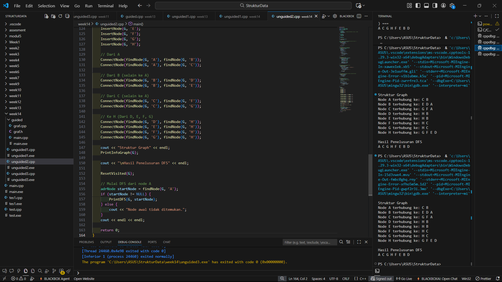

# <h1 align="center">Laporan Praktikum Modul 14 <br> Graph </h1>
<p align="center">DENNA WAHYU SETYOBUDI - 103112430206</p>

## Dasar Teori

Pada materi ini menjelaskan tentang Graph. Graph adalah jenis struktur data umum yang susunan datanya tidak berdekatan satu sama lain (non-linier). Graph terdiri dari kumpulan simpul berhingga untuk menyimpan data dan antara dua buah simpul terdapat hubungan saling keterkaitan.
## Guided

### soal 1
graf.h
```go
#ifndef GRAF_H_INCLUDED
#define GRAF_H_INCLUDED

#include <iostream>
using namespace std;

typedef char infoGraph;

struct ElmNode;
struct ElmEdge;

typedef ElmNode *adrNode;
typedef ElmEdge *adrEdge;

struct ElmNode
{
    infoGraph info;
    int visited;
    adrEdge firstEdge;
    adrNode next;
};

struct ElmEdge
{
    adrNode node;
    adrEdge next;
};

struct Graph
{
    adrNode first;
};

// PRIMITIF GRAPH
void CreateGraph(Graph &G);
adrNode AllocateNode(infoGraph X);
adrEdge AllocateEdge(adrNode N);

void InsertNode(Graph &G, infoGraph X);
adrNode FindNode(Graph G, infoGraph X);

void ConnectNode(Graph &G, infoGraph A, infoGraph B);

void PrintInfoGraph(Graph G);

// Traversal
void ResetVisited(Graph &G);
void PrintDFS(Graph &G, adrNode N);
void PrintBFS(Graph &G, adrNode N);

#endif
```
graf.cpp
```go
#include "graf.h"
#include <queue>
#include <stack>

void CreateGraph(Graph &G)
{
    G.first = NULL;
}

adrNode AllocateNode(infoGraph X)
{
    adrNode P = new ElmNode;
    P->info = X;
    P->visited = 0;
    P->firstEdge = NULL;
    P->next = NULL;
    return P;
}

adrEdge AllocateEdge(adrNode N)
{
    adrEdge P = new ElmEdge;
    P->node = N;
    P->next = NULL;
    return P;
}

void InsertNode(Graph &G, infoGraph X)
{
    adrNode P = AllocateNode(X);
    P->next = G.first;
    G.first = P;
}

adrNode FindNode(Graph G, infoGraph X)
{
    adrNode P = G.first;
    while (P != NULL)
    {
        if (P->info == X)
            return P;
        P = P->next;
    }
    return NULL;
}

void ConnectNode(Graph &G, infoGraph A, infoGraph B)
{
    adrNode N1 = FindNode(G, A);
    adrNode N2 = FindNode(G, B);

    if (N1 == NULL || N2 == NULL)
    {
        cout << "Node tidak ditemukan!\n";
        return;
    }

    // Buat edge dari N1 ke N2
    adrEdge E1 = AllocateEdge(N2);
    E1->next = N1->firstEdge;
    N1->firstEdge = E1;

    // Karena undirected → buat edge balik
    adrEdge E2 = AllocateEdge(N1);
    E2->next = N2->firstEdge;
    N2->firstEdge = E2;
}

void PrintInfoGraph(Graph G)
{
    adrNode P = G.first;
    while (P != NULL)
    {
        cout << P->info << " -> ";
        adrEdge E = P->firstEdge;
        while (E != NULL)
        {
            cout << E->node->info << " ";
            E = E->next;
        }
        cout << endl;
        P = P->next;
    }
}

void ResetVisited(Graph &G)
{
    adrNode P = G.first;
    while (P != NULL)
    {
        P->visited = 0;
        P = P->next;
    }
}

void PrintDFS(Graph &G, adrNode N)
{
    if (N == NULL)
        return;

    N->visited = 1;
    cout << N->info << " ";

    adrEdge E = N->firstEdge;
    while (E != NULL)
    {
        if (E->node->visited == 0)
        {
            PrintDFS(G, E->node);
        }
        E = E->next;
    }
}

void PrintBFS(Graph &G, adrNode N)
{
    if (N == NULL)
        return;

    queue<adrNode> Q;
    Q.push(N);

    while (!Q.empty())
    {
        adrNode curr = Q.front();
        Q.pop();

        if (curr->visited == 0)
        {
            curr->visited = 1;
            cout << curr->info << " ";

            adrEdge E = curr->firstEdge;
            while (E != NULL)
            {
                if (E->node->visited == 0)
                {
                    Q.push(E->node);
                }
                E = E->next;
            }
        }
    }
}

```
main.cpp
```go
#include "graf.h"
#include "graf.cpp"
#include <iostream>
using namespace std;

int main()
{
    Graph G;
    CreateGraph(G);

    // Tambah node
    InsertNode(G, 'A');
    InsertNode(G, 'B');
    InsertNode(G, 'C');
    InsertNode(G, 'D');
    InsertNode(G, 'E');

    // Hubungkan node (graph tidak berarah)
    ConnectNode(G, 'A', 'B');
    ConnectNode(G, 'A', 'C');
    ConnectNode(G, 'B', 'D');
    ConnectNode(G, 'C', 'E');

    cout << "=== Struktur Graph ===\n";
    PrintInfoGraph(G);

    cout << "\n=== DFS dari Node A ===\n";
    ResetVisited(G);
    PrintDFS(G, FindNode(G, 'A'));

    cout << "\n\n=== BFS dari Node A ===\n";
    ResetVisited(G);
    PrintBFS(G, FindNode(G, 'A'));

    cout << endl;
    return 0;
}

```

> Output
> 

Pada perogram diatas kita membuat sebuah graph,kita membuat struct elmNode, struct elmEdge dan struct Graph pada satu file yaitu graf.h, dan kita panggil fungsi fungsi yang kita buat. 
Buat fungsi createGraph,allocateNode,allocateEdge,insertNode,connectNode,printInfoGraph,resetVisited,printDFS,printBFS pada file graf.cpp

Lalu kita buat fungsi main nya kita inisiasi graph serta masukan data dummy dan jalankan fungsi tersebut.

## Unguided

### Soal 1

```go
#include <iostream>
using namespace std;

typedef struct ElmNode *adrNode;
typedef struct ElmEdge *adrEdge;
typedef char infoGraph;

struct ElmNode {
    infoGraph info;
    int visited;
    adrEdge firstEdge;
    adrNode next;
};

struct ElmEdge {
    adrNode node; 
    adrEdge next;
};

struct Graph {
    adrNode first;
};


// Inisialisasi Graph
void CreateGraph(Graph &G) {
    G.first = NULL;
}

// Fungsi Helper: Mencari alamat node berdasarkan info karakternya
adrNode findNode(Graph G, char X) {
    adrNode P = G.first;
    while (P != NULL) {
        if (P->info == X) {
            return P;
        }
        P = P->next;
    }
    return NULL;
}

// Menambahkan Node baru ke dalam Graph
void InsertNode(Graph &G, infoGraph X) {
    adrNode P = new ElmNode;
    P->info = X;
    P->visited = 0;
    P->firstEdge = NULL;
    P->next = NULL;

    if (G.first == NULL) {
        G.first = P;
    } else {
        adrNode Q = G.first;
        while (Q->next != NULL) {
            Q = Q->next;
        }
        Q->next = P;
    }
}

// Menghubungkan dua node (Edge) secara dua arah (Undirected)
void ConnectNode(adrNode N1, adrNode N2) {
    if (N1 != NULL && N2 != NULL) {
        adrEdge E1 = new ElmEdge;
        E1->node = N2;
        E1->next = N1->firstEdge; 
        N1->firstEdge = E1;

        adrEdge E2 = new ElmEdge;
        E2->node = N1;
        E2->next = N2->firstEdge; 
        N2->firstEdge = E2;
    }
}

// Menampilkan isi Graph (Adjacency List)
void PrintInfoGraph(Graph G) {
    adrNode P = G.first;
    if (P == NULL) {
        cout << "Graph kosong." << endl;
        return;
    }

    while (P != NULL) {
        cout << "Node [" << P->info << "] terhubung dengan: ";
        adrEdge E = P->firstEdge;
        
        if (E == NULL) {
            cout << "(Tidak ada koneksi)";
        } else {
            while (E != NULL) {
                cout << E->node->info;
                E = E->next;
                if (E != NULL) {
                    cout << ", ";
                }
            }
        }
        cout << endl;
        P = P->next;
    }
}


int main() {
    Graph G;
    CreateGraph(G);

    InsertNode(G, 'A');
    InsertNode(G, 'B');
    InsertNode(G, 'C');
    InsertNode(G, 'D');
    InsertNode(G, 'E');
    InsertNode(G, 'F');
    InsertNode(G, 'G');
    InsertNode(G, 'H');

    cout << "Menghubungkan Node" << endl;
    
    // Koneksi A (A-B, A-C)
    ConnectNode(findNode(G, 'A'), findNode(G, 'B'));
    ConnectNode(findNode(G, 'A'), findNode(G, 'C'));

    // Koneksi B (B-D, B-E)
    ConnectNode(findNode(G, 'B'), findNode(G, 'D'));
    ConnectNode(findNode(G, 'B'), findNode(G, 'E'));

    // Koneksi C (C-F, C-G)
    ConnectNode(findNode(G, 'C'), findNode(G, 'F'));
    ConnectNode(findNode(G, 'C'), findNode(G, 'G'));

    // Koneksi H (D-H, E-H, F-H, G-H)
    ConnectNode(findNode(G, 'D'), findNode(G, 'H'));
    ConnectNode(findNode(G, 'E'), findNode(G, 'H'));
    ConnectNode(findNode(G, 'F'), findNode(G, 'H'));
    ConnectNode(findNode(G, 'G'), findNode(G, 'H'));

    cout << "Hasil Graph : " << endl;
    PrintInfoGraph(G);

    return 0;
}
```

> Output
> 

Pada perogram diatas kita membuat sebuah graph,kita membuat struct elmNode, struct elmEdge dan struct Graph

Buat fungsi createGraph,findNode,insertNode,connectNode,printInfoGraph

Lalu kita buat fungsi main nya kita inisiasi graph serta masukan data dummy dan jalankan fungsi tersebut.

### soal 2

```go
#include <iostream>
using namespace std;

typedef struct ElmNode *adrNode;
typedef struct ElmEdge *adrEdge;
typedef char infoGraph;

struct ElmNode {
    infoGraph info;
    int visited;        // Penanda untuk DFS/BFS (0 = belum, 1 = sudah)
    adrEdge firstEdge;  
    adrNode next;       
};

struct ElmEdge {
    adrNode node;       
    adrEdge next;       
};

struct Graph {
    adrNode first;
};

void CreateGraph(Graph &G) {
    G.first = NULL;
}

// Helper: Mencari alamat node berdasarkan label char (misal 'A')
adrNode findNode(Graph G, char X) {
    adrNode P = G.first;
    while (P != NULL) {
        if (P->info == X) {
            return P;
        }
        P = P->next;
    }
    return NULL;
}

// Menambahkan Node baru ke dalam Graph
void InsertNode(Graph &G, infoGraph X) {
    adrNode P = new ElmNode;
    P->info = X;
    P->visited = 0;
    P->firstEdge = NULL;
    P->next = NULL;

    if (G.first == NULL) {
        G.first = P;
    } else {
        adrNode Q = G.first;
        while (Q->next != NULL) {
            Q = Q->next;
        }
        Q->next = P;
    }
}

// Menghubungkan dua node 
void ConnectNode(adrNode N1, adrNode N2) {
    if (N1 != NULL && N2 != NULL) {
        adrEdge E1 = new ElmEdge;
        E1->node = N2;
        E1->next = N1->firstEdge;
        N1->firstEdge = E1;

        adrEdge E2 = new ElmEdge;
        E2->node = N1;
        E2->next = N2->firstEdge;
        N2->firstEdge = E2;
    }
}

// Menampilkan isi Graph (Adjacency List)
void PrintInfoGraph(Graph G) {
    adrNode P = G.first;
    while (P != NULL) {
        cout << "Node " << P->info << " terhubung ke: ";
        adrEdge E = P->firstEdge;
        if (E == NULL) cout << "-";
        while (E != NULL) {
            cout << E->node->info << " ";
            E = E->next;
        }
        cout << endl;
        P = P->next;
    }
}

// Reset status visited semua node menjadi 0 sebelum DFS dimulai
void ResetVisited(Graph G) {
    adrNode P = G.first;
    while (P != NULL) {
        P->visited = 0;
        P = P->next;
    }
}

// Prosedur DFS (Rekursif)
void PrintDFS(Graph G, adrNode N) {
    if (N == NULL) return;
    //Tandai node ini sudah dikunjungi
    N->visited = 1;

    cout << N->info << " ";

    adrEdge E = N->firstEdge;
    while (E != NULL) {
        if (E->node->visited == 0) {
            PrintDFS(G, E->node);
        }
        E = E->next;
    }
}

int main() {
    Graph G;
    CreateGraph(G);

    InsertNode(G, 'A');
    InsertNode(G, 'B');
    InsertNode(G, 'C');
    InsertNode(G, 'D');
    InsertNode(G, 'E');
    InsertNode(G, 'F');
    InsertNode(G, 'G');
    InsertNode(G, 'H');
    
    // Dari A
    ConnectNode(findNode(G, 'A'), findNode(G, 'B'));
    ConnectNode(findNode(G, 'A'), findNode(G, 'C'));

    // Dari B (selain ke A)
    ConnectNode(findNode(G, 'B'), findNode(G, 'D'));
    ConnectNode(findNode(G, 'B'), findNode(G, 'E'));

    // Dari C (selain ke A)
    ConnectNode(findNode(G, 'C'), findNode(G, 'F'));
    ConnectNode(findNode(G, 'C'), findNode(G, 'G'));

    // Ke H (Dari D, E, F, G)
    ConnectNode(findNode(G, 'D'), findNode(G, 'H'));
    ConnectNode(findNode(G, 'E'), findNode(G, 'H'));
    ConnectNode(findNode(G, 'F'), findNode(G, 'H'));
    ConnectNode(findNode(G, 'G'), findNode(G, 'H'));

    cout << "Struktur Graph" << endl;
    PrintInfoGraph(G);

    cout << "\nHasil Penelusuran DFS" << endl;
    
    ResetVisited(G);
    
    // Mulai DFS dari node A
    adrNode startNode = findNode(G, 'A');
    if (startNode != NULL) {
        PrintDFS(G, startNode);
    } else {
        cout << "Node awal tidak ditemukan.";
    }
    cout << endl << endl;

    return 0;
}
```
> Output
> 

Pada perogram diatas kita membuat sebuah graph,kita membuat struct elmNode, struct elmEdge dan struct Graph

Buat fungsi createGraph,findNode,insertNode,connectNode,printInfoGraph,resetVisited,printDFS

Lalu kita buat fungsi main nya kita inisiasi graph serta masukan data dummy dan jalankan fungsi tersebut.

### soal 3

```go
#include <iostream>
#include <queue>
using namespace std;

typedef struct ElmNode *adrNode;
typedef struct ElmEdge *adrEdge;
typedef char infoGraph;

struct ElmNode {
    infoGraph info;
    int visited;        // 0 = belum dikunjungi, 1 = sudah
    adrEdge firstEdge;
    adrNode next;
};

struct ElmEdge {
    adrNode node;
    adrEdge next;
};

struct Graph {
    adrNode first;
};

void CreateGraph(Graph &G) {
    G.first = NULL;
}

adrNode findNode(Graph G, char X) {
    adrNode P = G.first;
    while (P != NULL) {
        if (P->info == X) return P;
        P = P->next;
    }
    return NULL;
}

void InsertNode(Graph &G, infoGraph X) {
    adrNode P = new ElmNode;
    P->info = X;
    P->visited = 0;
    P->firstEdge = NULL;
    P->next = NULL;

    if (G.first == NULL) {
        G.first = P;
    } else {
        adrNode Q = G.first;
        while (Q->next != NULL) {
            Q = Q->next;
        }
        Q->next = P;
    }
}

void ConnectNode(adrNode N1, adrNode N2) {
    if (N1 != NULL && N2 != NULL) {
        adrEdge E1 = new ElmEdge;
        E1->node = N2;
        E1->next = N1->firstEdge;
        N1->firstEdge = E1;

        adrEdge E2 = new ElmEdge;
        E2->node = N1;
        E2->next = N2->firstEdge;
        N2->firstEdge = E2;
    }
}

void ResetVisited(Graph G) {
    adrNode P = G.first;
    while (P != NULL) {
        P->visited = 0;
        P = P->next;
    }
}

void PrintBFS(Graph G, adrNode N) {
    if (N == NULL) {
        cout << "Node awal kosong." << endl;
        return;
    }

    queue<adrNode> Q;

    // Masukkan node awal ke Queue & tandai visited
    Q.push(N);
    N->visited = 1;

    // Loop selama Queue tidak kosong
    while (!Q.empty()) {
        adrNode current = Q.front();
        Q.pop();

        cout << current->info << " ";

        // Masukkan semua tetangga yang belum dikunjungi ke Queue
        adrEdge E = current->firstEdge;
        while (E != NULL) {
            if (E->node->visited == 0) {
                E->node->visited = 1; 
                Q.push(E->node);
            }
            E = E->next;
        }
    }
}

int main() {
    Graph G;
    CreateGraph(G);

    InsertNode(G, 'A'); InsertNode(G, 'B'); InsertNode(G, 'C');
    InsertNode(G, 'D'); InsertNode(G, 'E'); InsertNode(G, 'F');
    InsertNode(G, 'G'); InsertNode(G, 'H');

    ConnectNode(findNode(G, 'A'), findNode(G, 'B'));
    ConnectNode(findNode(G, 'A'), findNode(G, 'C'));
    
    ConnectNode(findNode(G, 'B'), findNode(G, 'D'));
    ConnectNode(findNode(G, 'B'), findNode(G, 'E'));
    
    ConnectNode(findNode(G, 'C'), findNode(G, 'F'));
    ConnectNode(findNode(G, 'C'), findNode(G, 'G'));
    
    ConnectNode(findNode(G, 'D'), findNode(G, 'H'));
    ConnectNode(findNode(G, 'E'), findNode(G, 'H'));
    ConnectNode(findNode(G, 'F'), findNode(G, 'H'));
    ConnectNode(findNode(G, 'G'), findNode(G, 'H'));

    cout << "Hasil Penelusuran BFS" << endl;
    
    ResetVisited(G); 
    
    PrintBFS(G, findNode(G, 'A'));
    
    cout << endl;
    return 0;
}
```

> Output
> 

Pada perogram diatas kita membuat sebuah graph,kita membuat struct elmNode, struct elmEdge dan struct Graph

Buat fungsi createGraph,findNode,insertNode,connectNode,printInfoGraph,resetVisited,printBFS

Lalu kita buat fungsi main nya kita inisiasi graph serta masukan data dummy dan jalankan fungsi tersebut.

## Referensi

1.https://www.trivusi.web.id/2022/07/struktur-data-graph.html(diakses 15/12/2025)

