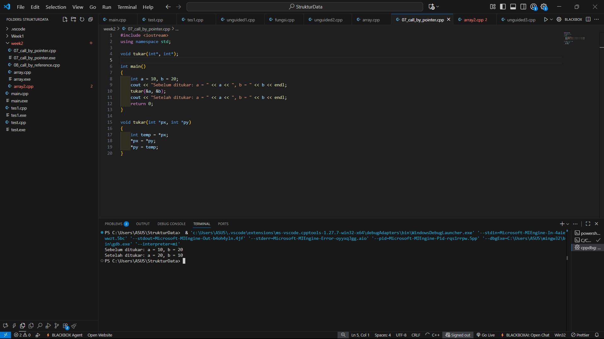
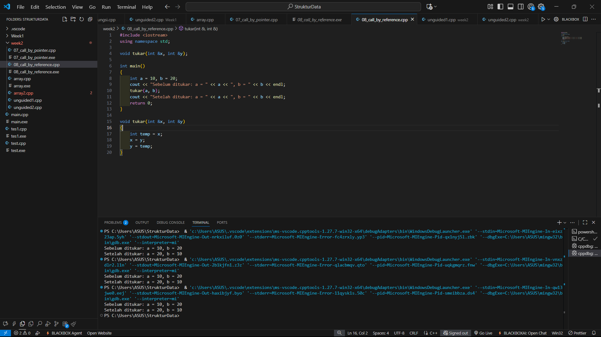
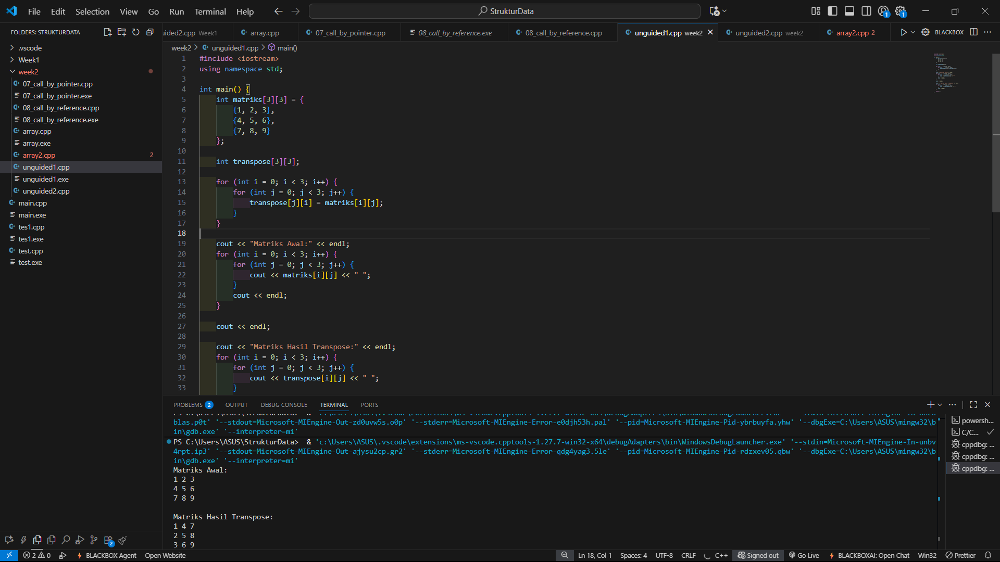
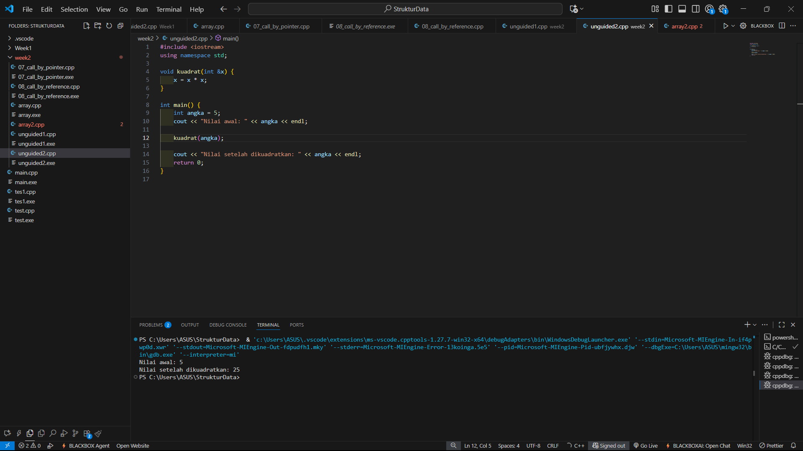

# <h1 align="center">Laporan Praktikum Modul 2 <br> Pengenalan C++ (Bagian Kedua)</h1>
<p align="center">DENNA WAHYU SETYOBUDI - 103112430206</p>

## Dasar Teori

Pada materi ini menjelaskan tentang array,pointer,fungsi dan prosedur dalam c++. Array merupakan struktur data yang digunakan untuk menyimpan sekumpulan data dalam satu tempat, setiap data dalam Array memiliki indeks sehingga kita akan mudah memprosesnya. Lalu Dalam C++, Pointer adalah variabel yang menyimpan alamat variabel lain. Pointer tidak hanya dapat menyimpan alamat satu variabel, tetapi juga dapat menyimpan alamat sel array. Lalu Fungsi adalah sub-program yang bisa digunakan kembali baik di dalam program itu sendiri, maupun di program yang lain.Fungsi dapat menerima input dan menghasilkan output. Contoh fungsi yang sering kita buat adalah fungsi main(). Fungsi yang tidak menerima input, kadang juga disebut dengan prosedur.

## Guided

### soal 1

call by pointer
```go
#include <iostream>
using namespace std;

void tukar(int*, int*);

int main()
{
    int a = 10, b = 20;
    cout << "Sebelum ditukar: a = " << a << ", b = " << b << endl;
    tukar(&a, &b);
    cout << "Setelah ditukar: a = " << a << ", b = " << b << endl;
    return 0;
}

void tukar(int *px, int *py)
{
    int temp = *px;
    *px = *py;
    *py = temp;
}
```
> Output
> 

Pada perogram diatas kita harus melakukan pemanggilan dengan pointer untuk melewatkan parameter, dengan mendeklarasikan sebuah fungsi berisi parameter *px dan *py yang berupa variabel pointer. *px berarti nilai yang ada di alamat px, yaitu nilai a,*py berarti nilai yang ada di alamat py, yaitu nilai b dan temp digunakan sebagai penyimpanan sementara saat menukar.

Pada int main kita memiliki 2 angka a=10 dan b=20 lalu Kita memanggil tukar(&a, &b); supaya fungsi tukar bisa mengubah nilai aslinya langsung, bukan hanya salinannya. dengan langkah pada fungsi tukar kita mendapat outputnya setelah ditukar
### soal 2

call by reference
```go
#include <iostream>
using namespace std;

void tukar(int &x, int &y);

int main()
{
    int a = 10, b = 20;
    cout << "Sebelum ditukar: a = " << a << ", b = " << b << endl;
    tukar(a, b);
    cout << "Setelah ditukar: a = " << a << ", b = " << b << endl;
    return 0;
}

void tukar(int &x, int &y)
{
    int temp = x;
    x = y;
    y = temp;
}
```
> Output
> 

Untuk program diatas kurang lebih sama hanya kita harus memanggil menggunakan reference, terdepat beberapa perbedaan pada soal 1 yaitu parameter pada fungsi tukar ditulis dengan int &x dan int &y bukan dengan *px dan *py yang dimana tanda & di parameter fungsi artinya: variabel ini adalah referensi ke variabel asli, jadi tidak membuat salinan. semua perubahan langsung mengubah nilai aslinya, yang membuat pemanggilan ini lebih sederhana.
## Unguided

### Soal 1

Buatlah sebuah program untuk melakukan transpose pada sebuah matriks persegi berukuran 3x3. Operasi transpose adalah mengubah baris menjadi kolom dan sebaliknya. Inisialisasi matriks awal di dalam kode, kemudian buat logika untuk melakukan transpose dan simpan hasilnya ke dalam matriks baru. Terakhir, tampilkan matriks awal dan matriks hasil transpose.
```go
#include <iostream>
using namespace std;

int main() {
    int matriks[3][3] = {
        {1, 2, 3},
        {4, 5, 6},
        {7, 8, 9}
    };

    int transpose[3][3];

    for (int i = 0; i < 3; i++) {
        for (int j = 0; j < 3; j++) {
            transpose[j][i] = matriks[i][j];
        }
    }

    cout << "Matriks Awal:" << endl;
    for (int i = 0; i < 3; i++) {
        for (int j = 0; j < 3; j++) {
            cout << matriks[i][j] << " ";
        }
        cout << endl;
    }

    cout << endl;

    cout << "Matriks Hasil Transpose:" << endl;
    for (int i = 0; i < 3; i++) {
        for (int j = 0; j < 3; j++) {
            cout << transpose[i][j] << " ";
        }
        cout << endl;
    }

    return 0;
}
```

> Output
> 

Pada program diatas kita harus melalukan transpose pada sebuah matriks 3x3. Dengan melakukan inisiasi isi matriks awal, lalu membuat matriks kosong yang nantinya akan berisi hasil transpose. Kita menggunakan 2 loop untuk mengubah baris jadi kolom, dan kolom jadi baris. Lalu menampilkan output yaitu matriks awal menggunakan 2 loop untuk mencetak matriks asli tiap baris. Lalu menampilkan output kedua yaitu Matriks Hasil Transpose menggunakan 2 loop juga untuk mencetak matriks tiap baris.

### Soal 2

Buatlah program yang menunjukkan penggunaan call by reference. Buat sebuah prosedur bernama kuadratkan yang menerima satu parameter integer secara referensi (&). Prosedur ini akan mengubah nilai asli variabel yang dilewatkan dengan nilai kuadratnya. Tampilkan nilai variabel di main() sebelum dan sesudah memanggil prosedur untuk membuktikan perubahannya.
```go
#include <iostream>
using namespace std;

void kuadrat(int &x) {
    x = x * x; 
}

int main() {
    int angka = 5; 
    cout << "Nilai awal: " << angka << endl;

    kuadrat(angka); 

    cout << "Nilai setelah dikuadratkan: " << angka << endl;
    return 0;
}

```

> Output
> 

Pada program diatas kita membuat prosedur penggunaan call by reference untuk mengkuadratkan sebuah bilangan, dimana pada program ini kita inisiasikan angka = 5. Prosedur kuadrat dengan parameter &x berisi rumus kuadrat yaitu x = x * x. Lalu output pertama yaitu menunjukan nilai awal yaitu angka 5, lalu kita panggil prosedur kuadrat dari angka. Kita mendapat output kedua yaitu nilai setelah dikuadratkan.

## Referensi

1.https://www.programiz.com/cpp-programming/pointers-arrays (diakses 6/10/2025)
2.https://www.petanikode.com/cpp-array/ (diakses 6/10/2025)
3.https://www.petanikode.com/cpp-fungsi/ (diakses 6/10/2025)
