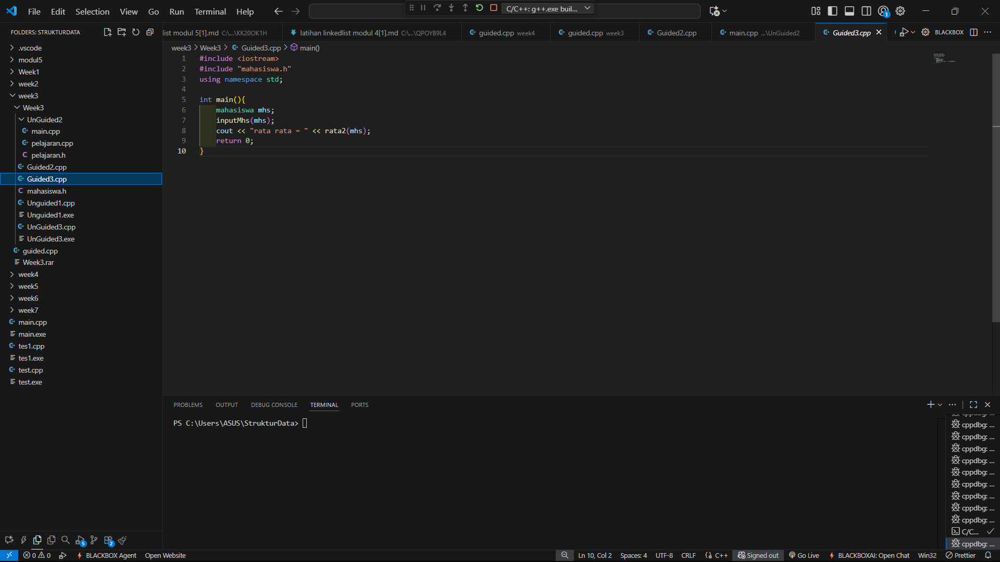
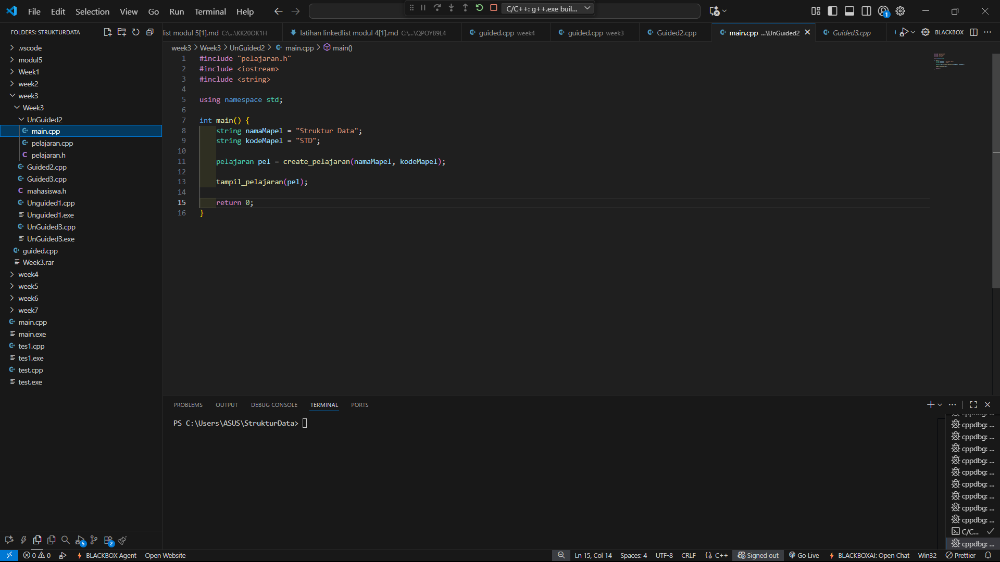

# <h1 align="center">Laporan Praktikum Modul 3 <br> Abstract Data Type (ADT)</h1>
<p align="center">DENNA WAHYU SETYOBUDI - 103112430206</p>

## Dasar Teori

Pada materi ini menjelaskan tentang Tipe Data Abstrak (ADT), adalah model konseptual yang mendefinisikan serangkaian operasi dan perilaku untuk suatu struktur data, tanpa menentukan bagaimana operasi tersebut diimplementasikan atau bagaimana data diorganisasikan dalam memori. Definisi ADT hanya menyebutkan operasi apa yang akan dilakukan , tetapi tidak menyebutkan bagaimana operasi tersebut akan diimplementasikan. ADT tidak menentukan bagaimana data akan diorganisasikan dalam memori dan algoritma apa yang akan digunakan untuk mengimplementasikan operasi tersebut.

## Guided

### soal 1

```go
#include "mahasiswa.h"
#include <iostream>
using namespace std;

void inputMhs(mahasiswa &m)
{
cout << "input nama = ";
cin >> (m) .nim;
cout << "input nilai = ";
cin >> (m) .nilai1;
cout << "input niali2 = ";
cin >> m .nilai2;

}
float rata2(mahasiswa m)
{
return float(m.nilai1 + m.nilai2) / 2;
}

```
> Output
> 

Pada program diatas kita disuruh untuk membuat ADT berupa inputMhs yang menerima inputan berupa nim,nilai1 dan nilai2, lalu mengembalikan nilai rerata yang diinputkan

### soal 2

```go
#include <iostream>
#include "mahasiswa.h"
using namespace std;

int main(){
    mahasiswa mhs;
    inputMhs(mhs);
    cout << "rata rata = " << rata2(mhs);
    return 0;
}
```
> Output
> 

Pada program diatas kita membuat fungsi main untuk mengeluarkan output dari nilai rerata yang telah diinputkan

## Unguided

### Soal 1

```go
#include <iostream>
#include <string>
using namespace std;

struct Mahasiswa {
    string nama;
    string nim;
    float uts;
    float uas;
    float tugas;
    float nilaiAkhir;
};

float hitungNilaiAkhir(float uts, float uas, float tugas) {
    return (0.3 * uts) + (0.4 * uas) + (0.3 * tugas);
}

void inputMahasiswa(Mahasiswa &mhs) {
    cout << "Masukkan Nama       : ";
    getline(cin, mhs.nama);
    cout << "Masukkan NIM        : ";
    getline(cin, mhs.nim);
    cout << "Masukkan Nilai UTS  : ";
    cin >> mhs.uts;
    cout << "Masukkan Nilai UAS  : ";
    cin >> mhs.uas;
    cout << "Masukkan Nilai Tugas: ";
    cin >> mhs.tugas;
    cin.ignore();
    mhs.nilaiAkhir = hitungNilaiAkhir(mhs.uts, mhs.uas, mhs.tugas);
}

void tampilMahasiswa(Mahasiswa mhs[], int jumlah) {
    cout << "Daftar Data Mahasiswa\n";
    cout << "==============================================\n";
    for (int i = 0; i < jumlah; i++) {
        cout << "Mahasiswa ke-" << i + 1 << endl;
        cout << "Nama         : " << mhs[i].nama << endl;
        cout << "NIM          : " << mhs[i].nim << endl;
        cout << "UTS          : " << mhs[i].uts << endl;
        cout << "UAS          : " << mhs[i].uas << endl;
        cout << "Tugas        : " << mhs[i].tugas << endl;
        cout << "Nilai Akhir  : " << mhs[i].nilaiAkhir << endl;
    }
}

int main() {
    Mahasiswa daftarMhs[10];
    int jumlah;

    cout << "Masukkan jumlah mahasiswa (max 10): ";
    cin >> jumlah;
    cin.ignore();

    if (jumlah > 10) {
        cout << "Jumlah melebihi batas maksimum (10)!" << endl;
        return 0;
    }

    for (int i = 0; i < jumlah; i++) {
        cout << "\nInput data mahasiswa ke-" << i + 1 << endl;
        inputMahasiswa(daftarMhs[i]);
    }

    tampilMahasiswa(daftarMhs, jumlah);

    return 0;
}
```

> Output
> 

Pada program diatas kita membuat sebuah ADT untuk menampilkan data mahasiswa yang akan kita inputkan, kita membuat sebuah struct berisi data mahasiswa yang akan disimpan. lalu membuat fungsi hitungNilaiAkhir, inputMahasiswa dan TampilMahasiswa. Pada fungsi main kita menginputkan jumlah mhs dan data mhs lalu mendapat output berupa list data mhs yang telah kita inputkan 

### Soal 2

```go
#include "pelajaran.h"
#include <iostream>
#include <string>

using namespace std;

int main() {
    string namaMapel = "Struktur Data";
    string kodeMapel = "STD";
    
    pelajaran pel = create_pelajaran(namaMapel, kodeMapel);
    
    tampil_pelajaran(pel);

    return 0;
}
```

> Output
> 

Pada program diatas kita membuat ADT untuk list mapel dengan menggunakan struct pelajaran pada file pelajaran.h, serta fungsi tampil Pelajaran pada file pelajaran.cpp. lalu fungsi main untuk untuk mengeksekusi file tsb.

### Soal 3

```go
#include <iostream>
using namespace std;

void tampilArray(int arr[3][3]) {
    for (int i = 0; i < 3; i++) {
        for (int j = 0; j < 3; j++) {
            cout << arr[i][j] << "\t";
        }
        cout << endl;
    }
}

void tukarNilai(int &a, int &b) {
    int temp = a;
    a = b;
    b = temp;
}

void tukarPosisi(int arr1[3][3], int arr2[3][3], int baris, int kolom) {
    int temp = arr1[baris][kolom];
    arr1[baris][kolom] = arr2[baris][kolom];
    arr2[baris][kolom] = temp;
}

void tukarPointer(int *p1, int *p2) {
    int temp = *p1;
    *p1 = *p2;
    *p2 = temp;
}

int main() {
    int ArrayA[3][3] = {
        {1, 2, 3},
        {4, 5, 6},
        {7, 8, 9}
    };

    int ArrayB[3][3] = {
        {10, 11, 12},
        {13, 14, 15},
        {16, 17, 18}
    };

    cout << "Array A sebelum ditukar:\n";
    tampilArray(ArrayA);
    cout << "\nArray B sebelum ditukar:\n";
    tampilArray(ArrayB);

    tukarPosisi(ArrayA, ArrayB, 1, 1);

    cout << "\nSetelah menukar elemen pada posisi [1][1]:\n";
    cout << "Array A:\n";
    tampilArray(ArrayA);
    cout << "\nArray B:\n";
    tampilArray(ArrayB);

    int nilaiX = 50, nilaiY = 100;
    int *ptr1 = &nilaiX;
    int *ptr2 = &nilaiY;

    cout << "\nNilai sebelum ditukar melalui pointer:\n";
    cout << "nilaiX = " << nilaiX << ", nilaiY = " << nilaiY << endl;

    tukarPointer(ptr1, ptr2);

    cout << "Nilai setelah ditukar melalui pointer:\n";
    cout << "nilaiX = " << nilaiX << ", nilaiY = " << nilaiY << endl;

    return 0;
}
```

> Output
> 

Pada program diatas kita membuat ADT untuk menukar sebuah array, kita membuat fungsi tampilArray, tukarNilai, tukarPosisi dan tukarPointer. pada fungsi main kita menggunakan data dummy untuk array tersebut lalu menampilkan array sebelum dan sesudah ditukar

## Referensi

1.https://www.geeksforgeeks.org/dsa/abstract-data-types/ (diakses 31/10/2025)

