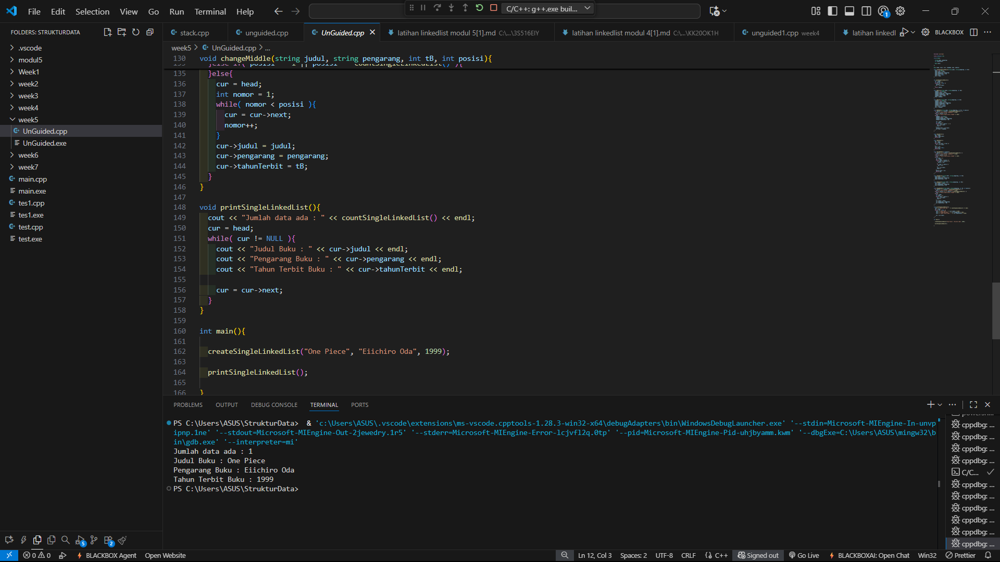

# <h1 align="center">Laporan Praktikum Modul 4 <br> Singly Linked List (Bagian Kedua)</h1>
<p align="center">DENNA WAHYU SETYOBUDI - 103112430206</p>

## Dasar Teori

Pada materi ini menjelaskan tentang Singly linked list. Linked List adalah salah satu bentuk struktur data, berisi kumpulan data (node) yang tersusun secara sekuensial, saling sambung - menyambung, dinamis. Dalam istilah ilustrasi di dunia nyata Linked List sering disebut juga Senarai Berantai. Dalam Konsepnya Linked List saling terhubung dengan bantuan variabel pointer. Jadi masing-masing data dalam Linked List disebut dengan node (simpul) yang menempati alokasi memori secara dinamis dan biasanya berupa struct yang terdiri dari beberapa field. 

## Guided

### soal 1

```go
#include <iostream>
using namespace std;

// Struktur Node
struct Node {
    int data;
    Node* next;
};

// Pointer awal
Node* head = nullptr;

// Fungsi untuk membuat node baru
Node* createNode(int data) {
    Node* newNode = new Node();
    newNode->data = data;
    newNode->next = nullptr;
    return newNode;
}

// ========== INSERT FUNCTION ==========
void insertDepan(int data) {
    Node* newNode = createNode(data);
    newNode->next = head;
    head = newNode;
    cout << "Data " << data << " berhasil ditambahkan di depan.\n";
}

void insertBelakang(int data) {
    Node* newNode = createNode(data);
    if (head == nullptr) {
        head = newNode;
    } else {
        Node* temp = head;
        while (temp->next != nullptr) {
            temp = temp->next;
        }
        temp->next = newNode;
    }
    cout << "Data " << data << " berhasil ditambahkan di belakang.\n";
}

void insertSetelah(int target, int dataBaru) {
    Node* temp = head;
    while (temp != nullptr && temp->data != target) {
        temp = temp->next;
    }

    if (temp == nullptr) {
        cout << "Data " << target << " tidak ditemukan!\n";
    } else {
        Node* newNode = createNode(dataBaru);
        newNode->next = temp->next;
        temp->next = newNode;
        cout << "Data " << dataBaru << " berhasil disisipkan setelah " << target << ".\n";
    }
}

// ========== DELETE FUNCTION ==========
void hapusNode(int data) {
    if (head == nullptr) {
        cout << "List kosong!\n";
        return;
    }

    Node* temp = head;
    Node* prev = nullptr;

    // Jika data di node pertama
    if (temp != nullptr && temp->data == data) {
        head = temp->next;
        delete temp;
        cout << "Data " << data << " berhasil dihapus.\n";
        return;
    }

    // Cari node yang akan dihapus
    while (temp != nullptr && temp->data != data) {
        prev = temp;
        temp = temp->next;
    }

    // Jika data tidak ditemukan
    if (temp == nullptr) {
        cout << "Data " << data << " tidak ditemukan!\n";
        return;
    }

    prev->next = temp->next;
    delete temp;
    cout << "Data " << data << " berhasil dihapus.\n";
}

// ========== UPDATE FUNCTION ==========
void updateNode(int dataLama, int dataBaru) {
    Node* temp = head;
    while (temp != nullptr && temp->data != dataLama) {
        temp = temp->next;
    }

    if (temp == nullptr) {
        cout << "Data " << dataLama << " tidak ditemukan!\n";
    } else {
        temp->data = dataBaru;
        cout << "Data " << dataLama << " berhasil diupdate menjadi " << dataBaru << ".\n";
    }
}

// ========== DISPLAY FUNCTION ==========
void tampilkanList() {
    if (head == nullptr) {
        cout << "List kosong!\n";
        return;
    }

    Node* temp = head;
    cout << "Isi Linked List: ";
    while (temp != nullptr) {
        cout << temp->data << " -> ";
        temp = temp->next;
    }
    cout << "NULL\n";
}

// ========== MAIN PROGRAM ==========
int main() {
    int pilihan, data, target, dataBaru;

    do {
        cout << "\n=== MENU SINGLE LINKED LIST ===\n";
        cout << "1. Insert Depan\n";
        cout << "2. Insert Belakang\n";
        cout << "3. Insert Setelah\n";
        cout << "4. Hapus Data\n";
        cout << "5. Update Data\n";
        cout << "6. Tampilkan List\n";
        cout << "0. Keluar\n";
        cout << "Pilih: ";
        cin >> pilihan;

        switch (pilihan) {
            case 1:
                cout << "Masukkan data: ";
                cin >> data;
                insertDepan(data);
                break;
            case 2:
                cout << "Masukkan data: ";
                cin >> data;
                insertBelakang(data);
                break;
            case 3:
                cout << "Masukkan data target: ";
                cin >> target;
                cout << "Masukkan data baru: ";
                cin >> dataBaru;
                insertSetelah(target, dataBaru);
                break;
            case 4:
                cout << "Masukkan data yang ingin dihapus: ";
                cin >> data;
                hapusNode(data);
                break;
            case 5:
                cout << "Masukkan data lama: ";
                cin >> data;
                cout << "Masukkan data baru: ";
                cin >> dataBaru;
                updateNode(data, dataBaru);
                break;
            case 6:
                tampilkanList();
                break;
            case 0:
                cout << "Program selesai.\n";
                break;
            default:
                cout << "Pilihan tidak valid!\n";
        }
    } while (pilihan != 0);

return0;
}
```
> Output
> 

Pada perogram diatas kita harus membuat sebuah list yang memiliki beberapa fungsi menggunakan singly linked list, kita membuat sebuah struck berisi data yang kita simpan serta pointer ke node berikutnya. Kita membuat fungsi insert depan, belakang dan setelah, insert setelah digunkan untuk memasukan data yang kita mau inputkan ke setelah data yang kita pilih. kita buat fungsi hapus, update dan tampilkan list data, untuk fungsi update node kita gunakan untuk mengubah data yang kita pilih ke data yang baru.

Lalu kita buat fungsi main nya kita menggunakan switch case yang berisi 1-6 untuk memilih fungsi yang kita buat serta 0 untuk menghentikan program.

## Unguided

### Soal 1

buatlah single linked list untuk Antrian yang menyimpan data pembeli( nama dan pesanan). program memiliki beberapa menu seperti tambah antrian,  layani antrian(hapus), dan tampilkan antrian. \*antrian pertama harus yang pertama dilayani
```go
#include <iostream>
#include <string>
using namespace std;

struct Node {
    string nama;
    string pesanan;
    Node* next;
};

class Antrian {
private:
    Node* front;
    Node* rear;

public:
    Antrian() {
        front = rear = nullptr;
    }

    bool isEmpty() {
        return front == nullptr;
    }

    void tambahAntrian(string nama, string pesanan) {
        Node* baru = new Node();
        baru->nama = nama;
        baru->pesanan = pesanan;
        baru->next = nullptr;

        if (isEmpty()) {
            front = rear = baru;
        } else {
            rear->next = baru;
            rear = baru;
        }
        cout << nama << " dengan pesanan '" << pesanan << "' telah ditambahkan ke antrian.\n";
    }

    void layaniAntrian() {
        if (isEmpty()) {
            cout << "Antrian kosong, tidak ada yang bisa dilayani.\n";
            return;
        }

        Node* hapus = front;
        cout << hapus->nama << " dengan pesanan '" << hapus->pesanan << "' telah dilayani.\n";
        front = front->next;
        delete hapus;

        if (front == nullptr)
            rear = nullptr;
    }

    void tampilkanAntrian() {
        if (isEmpty()) {
            cout << "Antrian kosong.\n";
            return;
        }

        cout << "\n Daftar Antrian:\n";
        Node* temp = front;
        int i = 1;
        while (temp != nullptr) {
            cout << i << ". " << temp->nama << " - " << temp->pesanan << endl;
            temp = temp->next;
            i++;
        }
    }
};

int main() {
    Antrian antrian;
    int pilihan;
    string nama, pesanan;

    do {
        cout << "\n=== MENU ANTRIAN ===\n";
        cout << "1. Tambah Antrian\n";
        cout << "2. Layani Antrian\n";
        cout << "3. Tampilkan Antrian\n";
        cout << "4. Keluar\n";
        cout << "Pilih menu: ";
        cin >> pilihan;
        cin.ignore();

        switch (pilihan) {
            case 1:
                cout << "Masukkan nama pembeli: ";
                getline(cin, nama);
                cout << "Masukkan pesanan: ";
                getline(cin, pesanan);
                antrian.tambahAntrian(nama, pesanan);
                break;
            case 2:
                antrian.layaniAntrian();
                break;
            case 3:
                antrian.tampilkanAntrian();
                break;
            case 4:
                cout << "Program selesai.\n";
                break;
            default:
                cout << "Pilihan tidak valid.\n";
        }

    } while (pilihan != 4);

    return 0;
}

```

> Output
> 

Pada program diatas kita harus membuat sebuah list yang memiliki beberapa fungsi menggunakan single linked list, kita membuat sebuah struct yang berisi string dari nama dan pesanan, serta pointer ke node berikutanya. disini menggunakan library include string serta public untuk class Antrian agar bisa dipanggil dari fungsi main. kita membuat fungsi tambahAntrian, layaniAntrian dan tampilkanAntrian, lalu pada fungsi main kita menggunakan switch case untuk memilih fungsi yang ingin dijalankan. 

### Soal 2

buatlah program kode untuk membalik (reverse) singly linked list (1-2-3 menjadi 3-2-1) 
```go
#include <iostream>
using namespace std;

struct Node {
    int data;
    Node* next;
};

class LinkedList {
private:
    Node* head;

public:
    LinkedList() {
        head = NULL;
    }

    void tambahData(int data) {
        Node* baru = new Node();
        baru->data = data;
        baru->next = NULL;

        if (head == NULL) {
            head = baru;
        } else {
            Node* temp = head;
            while (temp->next != NULL)
                temp = temp->next;
            temp->next = baru;
        }
    }

    void tampilkan() {
        Node* temp = head;
        while (temp != NULL) {
            cout << temp->data;
            if (temp->next != NULL) cout << " -> ";
            temp = temp->next;
        }
        cout << endl;
    }

    void reverse() {
        Node* prev = NULL;
        Node* current = head;
        Node* next = NULL;

        while (current != NULL) {
            next = current->next;
            current->next = prev;
            prev = current;
            current = next;
        }
        head = prev;
    }
};

int main() {
    LinkedList list;
    list.tambahData(1);
    list.tambahData(2);
    list.tambahData(3);
    list.tambahData(4);
    list.tambahData(5);

    cout << "Sebelum dibalik: ";
    list.tampilkan();

    list.reverse();

    cout << "Setelah dibalik: ";
    list.tampilkan();

    return 0;
}

```

> Output
> 

Pada program diatas kita membuat sebuah program untuk membalikan urutan angka menggunkan single linked list, kita membuat sebuah struct berisi int data dan pointer. disini kita memiliki fungsi tambahData, tampilkan dan reverse untuk membilakn urutan, lalu pada fungsi main kita menggunakan angka dummy saja dan outputnya berupa urutan angka sebelum dibalik dan sesudah dibalik.

## Referensi

1.https://daismabali.com/artikel_detail/54/1/Mengenal-Single-Linked-List-dalam-Struktur-Data.html (diakses 31/10/2025)


