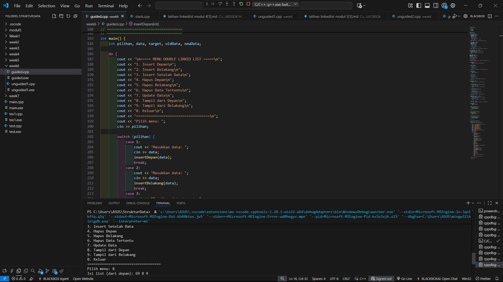
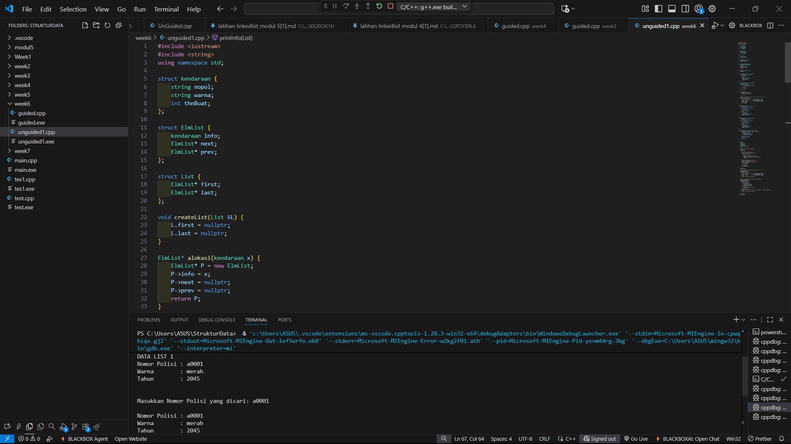

# <h1 align="center">Laporan Praktikum Modul 6 <br> Doubly Linked List (Bagian Pertama)</h1>
<p align="center">DENNA WAHYU SETYOBUDI - 103112430206</p>

## Dasar Teori

Pada materi ini menjelaskan tentang doubly linked list. doubly linked List merupakan struktur data yang lebih kompleks daripada single linked list, tetapi menawarkan beberapa keuntungan. Keuntungan utama dari daftar tertaut ganda adalah memungkinkan traversal daftar yang efisien di kedua arah. Hal ini karena setiap simpul dalam daftar berisi penunjuk ke simpul sebelumnya dan penunjuk ke simpul berikutnya. Hal ini memungkinkan penyisipan dan penghapusan simpul dari daftar dengan cepat dan mudah, serta traversal daftar yang efisien di kedua arah.

## Guided

### soal 1

```go
#include <iostream>
using namespace std;

//struktur node
struct Node {
    int data;
    Node* prev;
    Node* next;
};

//pointer global
Node* head = nullptr;
Node* tail = nullptr;

void insertDepan(int data) {
    Node* newNode = new Node();
    newNode->data = data;
    newNode->prev = nullptr;
    newNode->next = head;

    if(head != nullptr)
        head->prev = newNode;
    else
        tail = newNode; //jika list kosong
    
    head = newNode;
    cout << "data" << data << "berhasil ditambahkan di depan.\n";
}

void insertBelakang(int data){
    Node* newNode = new Node();
    newNode->data = data;
    newNode->next = nullptr;
    newNode->prev = tail;

    if (tail != nullptr)
        tail->next = newNode;
    else 
        head = newNode; //jika list kosong
    
    tail = newNode;
    cout << "data" << data << "berhasil ditambahkan di belakang. \n";
}

void insertSetelah(int target, int data){
Node* current = head;
while (current != nullptr && current->data != target)
    current = current->next;
if (current == nullptr) {
    cout << "data" << target << "tidak ditemukan.\n";
    return;
}

Node* newNode = new Node();
newNode->data = data;
newNode->next = current->next;
newNode->prev = current;

if (current->next !=nullptr)
    current->prev = newNode;
else
    tail = newNode;

current->next = newNode;
cout << "data" << data << "berhasil disisipkan setelah" << target <<".\n";
}

void hapusDepan(){
    if (head == nullptr) {
        cout << "List kosong, tidak ada yang dihapus.\n";
        return;
    }

    Node* temp = head;
    head = head->next;

    if (head != nullptr)
        head->prev = nullptr;
    else
        tail = nullptr;

    cout << "Data " << temp->data << " di depan berhasil dihapus.\n";
    delete temp;
}

void hapusBelakang(){
    if (tail == nullptr) {
        cout << "List Kosong \n";
        return;
    }

    Node* temp =tail;
    tail= tail->prev;

    if(tail != nullptr)
        tail->next = nullptr;
    else
        head = nullptr;
    
    cout << "data" << temp->data <<"dihapus dari belakang.\n";
    delete temp;
}

void hapusData(int target) {
if (head == nullptr) {
        cout << "List kosong, tidak ada yang dihapus.\n";
        return;
    }

    Node* current = head;
    while (current != nullptr && current->data != target)
        current = current->next;

    if (current == nullptr) {
        cout << "Data " << target << " tidak ditemukan.\n";
        return;
    }

    if (current->prev != nullptr)
        current->prev->next = current->next;
    else
        head = current->next;

    if (current->next != nullptr)
        current->next->prev = current->prev;
    else
        tail = current->prev;

    cout << "Data " << target << " berhasil dihapus.\n";
    delete current;
}

void updateData(int oldData, int newData) {
    Node* current = head;
    while (current != nullptr && current->data != oldData)
        current = current->next;

    if (current == nullptr) {
        cout << "Data " << oldData << " tidak ditemukan.\n";
        return;
    }

    current->data = newData;
    cout << "Data " << oldData << " diubah menjadi " << newData<<".\n";
}

void tampilDepan() {
    if (head == nullptr) {
        cout << "List kosong.\n";
        return;
    }

    cout << "Isi list (dari depan): ";
    Node* current = head;
    while (current != nullptr) {
        cout << current->data << " ";
        current = current->next;
    }
    cout << "\n";
}

// ====================================
// Fungsi: Tampilkan dari belakang
// ====================================
void tampilBelakang() {
    if (tail == nullptr) {
        cout << "List kosong.\n";
        return;
    }

    cout << "Isi list (dari belakang): ";
    Node* current = tail;
    while (current != nullptr) {
        cout << current->data << " ";
        current = current->prev;
    }
    cout << "\n";
}

// ====================================
// MAIN PROGRAM (MENU INTERAKTIF)
// ====================================
int main() {
    int pilihan, data, target, oldData, newData;

    do {
        cout << "\n===== MENU DOUBLE LINKED LIST =====\n";
        cout << "1. Insert Depan\n";
        cout << "2. Insert Belakang\n";
        cout << "3. Insert Setelah Data\n";
        cout << "4. Hapus Depan\n";
        cout << "5. Hapus Belakang\n";
        cout << "6. Hapus Data Tertentu\n";
        cout << "7. Update Data\n";
        cout << "8. Tampil dari Depan\n";
        cout << "9. Tampil dari Belakang\n";
        cout << "0. Keluar\n";
        cout << "===================================\n";
        cout << "Pilih menu: ";
        cin >> pilihan;

        switch (pilihan) {
            case 1:
                cout << "Masukkan data: ";
                cin >> data;
                insertDepan(data);
                break;
            case 2:
                cout << "Masukkan data: ";
                cin >> data;
                insertBelakang(data);
                break;
            case 3:
                cout << "Masukkan data target: ";
                cin >> target;
                cout << "Masukkan data baru: ";
                cin >> data;
                insertSetelah(target, data);
                break;
            case 4:
                hapusDepan();
                break;
            case 5:
                hapusBelakang();
                break;
            case 6:
                cout << "Masukkan data yang ingin dihapus: ";
                cin >> target;
                hapusData(target);
                break;
            case 7:
                cout << "Masukkan data lama: ";
                cin >> oldData;
                cout << "Masukkan data baru: ";
                cin >> newData;
                updateData(oldData, newData);
                break;
            case 8:
                tampilDepan();
                break;
            case 9:
                tampilBelakang();
                break;
            case 0:
                cout << "👋 Keluar dari program.\n";
                break;
            default:
                cout << "Pilihan tidak valid.\n";
        }

    } while (pilihan != 0);

    return 0;
}
```
> Output
> 

Pada perogram diatas kita harus membuat sebuah list yang memiliki beberapa fungsi menggunakan singly linked list, kita membuat sebuah struck berisi data yang kita simpan serta pointer ke node berikutnya. Kita membuat fungsi insert depan, belakang dan setelah, insert setelah digunkan untuk memasukan data yang kita mau inputkan ke setelah data yang kita pilih. kita buat fungsi hapus, update dan tampilkan list data, untuk fungsi update node kita gunakan untuk mengubah data yang kita pilih ke data yang baru.

Lalu kita buat fungsi main nya kita menggunakan switch case yang berisi 1-6 untuk memilih fungsi yang kita buat serta 0 untuk menghentikan program.

## Unguided

### Soal 1

buatlah single linked list untuk Antrian yang menyimpan data pembeli( nama dan pesanan). program memiliki beberapa menu seperti tambah antrian,  layani antrian(hapus), dan tampilkan antrian. \*antrian pertama harus yang pertama dilayani
```go
#include <iostream>
#include <string>
using namespace std;

struct Node {
    string nama;
    string pesanan;
    Node* next;
};

class Antrian {
private:
    Node* front;
    Node* rear;

public:
    Antrian() {
        front = rear = nullptr;
    }

    bool isEmpty() {
        return front == nullptr;
    }

    void tambahAntrian(string nama, string pesanan) {
        Node* baru = new Node();
        baru->nama = nama;
        baru->pesanan = pesanan;
        baru->next = nullptr;

        if (isEmpty()) {
            front = rear = baru;
        } else {
            rear->next = baru;
            rear = baru;
        }
        cout << nama << " dengan pesanan '" << pesanan << "' telah ditambahkan ke antrian.\n";
    }

    void layaniAntrian() {
        if (isEmpty()) {
            cout << "Antrian kosong, tidak ada yang bisa dilayani.\n";
            return;
        }

        Node* hapus = front;
        cout << hapus->nama << " dengan pesanan '" << hapus->pesanan << "' telah dilayani.\n";
        front = front->next;
        delete hapus;

        if (front == nullptr)
            rear = nullptr;
    }

    void tampilkanAntrian() {
        if (isEmpty()) {
            cout << "Antrian kosong.\n";
            return;
        }

        cout << "\n Daftar Antrian:\n";
        Node* temp = front;
        int i = 1;
        while (temp != nullptr) {
            cout << i << ". " << temp->nama << " - " << temp->pesanan << endl;
            temp = temp->next;
            i++;
        }
    }
};

int main() {
    Antrian antrian;
    int pilihan;
    string nama, pesanan;

    do {
        cout << "\n=== MENU ANTRIAN ===\n";
        cout << "1. Tambah Antrian\n";
        cout << "2. Layani Antrian\n";
        cout << "3. Tampilkan Antrian\n";
        cout << "4. Keluar\n";
        cout << "Pilih menu: ";
        cin >> pilihan;
        cin.ignore();

        switch (pilihan) {
            case 1:
                cout << "Masukkan nama pembeli: ";
                getline(cin, nama);
                cout << "Masukkan pesanan: ";
                getline(cin, pesanan);
                antrian.tambahAntrian(nama, pesanan);
                break;
            case 2:
                antrian.layaniAntrian();
                break;
            case 3:
                antrian.tampilkanAntrian();
                break;
            case 4:
                cout << "Program selesai.\n";
                break;
            default:
                cout << "Pilihan tidak valid.\n";
        }

    } while (pilihan != 4);

    return 0;
}

```

> Output
> 

Pada program diatas kita harus membuat sebuah list yang memiliki beberapa fungsi menggunakan single linked list, kita membuat sebuah struct yang berisi string dari nama dan pesanan, serta pointer ke node berikutanya. disini menggunakan library include string serta public untuk class Antrian agar bisa dipanggil dari fungsi main. kita membuat fungsi tambahAntrian, layaniAntrian dan tampilkanAntrian, lalu pada fungsi main kita menggunakan switch case untuk memilih fungsi yang ingin dijalankan. 

### Soal 2

buatlah program kode untuk membalik (reverse) singly linked list (1-2-3 menjadi 3-2-1) 
```go
#include <iostream>
using namespace std;

struct Node {
    int data;
    Node* next;
};

class LinkedList {
private:
    Node* head;

public:
    LinkedList() {
        head = NULL;
    }

    void tambahData(int data) {
        Node* baru = new Node();
        baru->data = data;
        baru->next = NULL;

        if (head == NULL) {
            head = baru;
        } else {
            Node* temp = head;
            while (temp->next != NULL)
                temp = temp->next;
            temp->next = baru;
        }
    }

    void tampilkan() {
        Node* temp = head;
        while (temp != NULL) {
            cout << temp->data;
            if (temp->next != NULL) cout << " -> ";
            temp = temp->next;
        }
        cout << endl;
    }

    void reverse() {
        Node* prev = NULL;
        Node* current = head;
        Node* next = NULL;

        while (current != NULL) {
            next = current->next;
            current->next = prev;
            prev = current;
            current = next;
        }
        head = prev;
    }
};

int main() {
    LinkedList list;
    list.tambahData(1);
    list.tambahData(2);
    list.tambahData(3);
    list.tambahData(4);
    list.tambahData(5);

    cout << "Sebelum dibalik: ";
    list.tampilkan();

    list.reverse();

    cout << "Setelah dibalik: ";
    list.tampilkan();

    return 0;
}

```

> Output
> 

Pada program diatas kita membuat sebuah program untuk membalikan urutan angka menggunkan single linked list, kita membuat sebuah struct berisi int data dan pointer. disini kita memiliki fungsi tambahData, tampilkan dan reverse untuk membilakn urutan, lalu pada fungsi main kita menggunakan angka dummy saja dan outputnya berupa urutan angka sebelum dibalik dan sesudah dibalik.

## Referensi

1.https://daismabali.com/artikel_detail/54/1/Mengenal-Single-Linked-List-dalam-Struktur-Data.html (diakses 31/10/2025)
