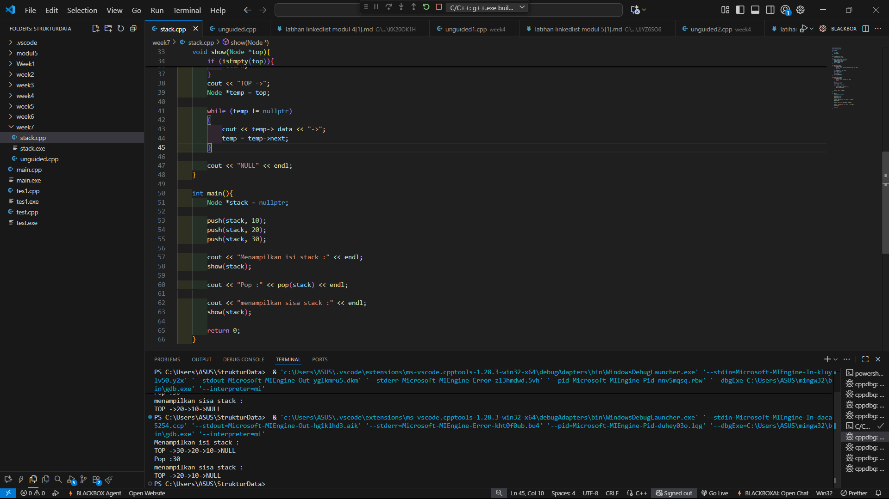
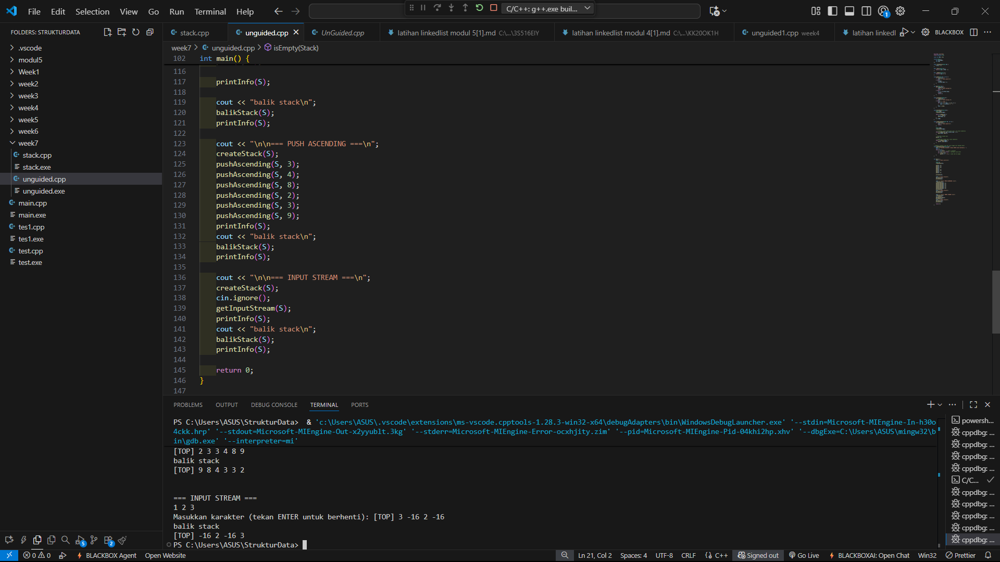

# <h1 align="center">Laporan Praktikum Modul 7 <br> Stack</h1>
<p align="center">DENNA WAHYU SETYOBUDI - 103112430206</p>

## Dasar Teori

Pada materi ini menjelaskan tentang Stack. Stack adalah struktur data linear yang mengikuti prinsip LIFO (Last In First Out), yaitu elemen terakhir yang dimasukkan akan dikeluarkan pertama kali. Artinya, baik operasi penyisipan maupun penghapusan hanya terjadi di satu sisi.

## Guided

### soal 1

```go
#include <iostream>
using namespace std;

struct Node
{
    int data;
    Node *next;
};

bool isEmpty(Node *top){
    return top == nullptr;
}
void push (Node *&top, int data){
    Node *newNode = new Node();
    newNode->data = data;
    newNode->next = top;
    top = newNode;
}

int pop(Node *&top){
    if (isEmpty(top)){
        cout << "stack kosong, tidak bisa pop!" << endl;
        return 0;
    }
    int poppedData = top->data;
    Node *temp = top;
    top = top->next;

    delete temp;
    return poppedData;
}

void show(Node *top){
    if (isEmpty(top)){
        cout << "stack kosongh." << endl;
        return;
    }
    cout << "TOP ->";
    Node *temp = top;

    while (temp != nullptr)
    {
        cout << temp-> data << "->";
        temp = temp->next;
    }

    cout << "NULL" << endl;
}

int main(){
    Node *stack = nullptr;

    push(stack, 10);
    push(stack, 20);
    push(stack, 30);

    cout << "Menampilkan isi stack :" << endl;
    show(stack);

    cout << "Pop :" << pop(stack) << endl;

    cout << "menampilkan sisa stack :" << endl;
    show(stack);
    
    return 0;
}
```
> Output
> 

Pada perogram diatas kita harus membuat sebuah adt stack, kita membuat sebuah struck berisi data yang kita simpan serta pointer ke node berikutnya. Kita membuat fungsi isEmpty,push, pop dan show 

Lalu kita buat fungsi main nya kita buat pointer stack dan menginisialisasi stack kosong lalu menambahkan data dummy yaitu 10,20,30 ke stack menggunakan push lalu menampilkan stack lalu menghapus data teratas menggunakan pop lalu menampilkan stack 

## Unguided

### Soal 1

buatlah single linked list untuk Antrian yang menyimpan data pembeli( nama dan pesanan). program memiliki beberapa menu seperti tambah antrian,  layani antrian(hapus), dan tampilkan antrian. \*antrian pertama harus yang pertama dilayani
```go
#include <iostream>
using namespace std;

const int MAX = 20;

struct Stack {
    int info[MAX];
    int top;
};

void createStack(Stack &S) {
    S.top = -1;
}

bool isFull(Stack S) {
    return S.top == MAX - 1;
}

bool isEmpty(Stack S) {
    return S.top == -1;
}

void push(Stack &S, int x) {
    if (isFull(S)) {
        cout << "Stack penuh!\n";
    } else {
        S.top++;
        S.info[S.top] = x;
    }
}

int pop(Stack &S) {
    if (isEmpty(S)) {
        cout << "Stack kosong!\n";
        return -1;
    } else {
        int x = S.info[S.top];
        S.top--;
        return x;
    }
}

void printInfo(Stack S) {
    if (isEmpty(S)) {
        cout << "Stack kosong.\n";
    } else {
        cout << "[TOP] ";
        for (int i = S.top; i >= 0; i--) {
            cout << S.info[i] << " ";
        }
        cout << endl;
    }
}

void balikStack(Stack &S) {
    Stack temp;
    createStack(temp);

    while (!isEmpty(S)) {
        int x = pop(S);
        push(temp, x);
    }
    S = temp;
}

void pushAscending(Stack &S, int x) {
    if (isFull(S)) {
        cout << "Stack penuh!\n";
        return;
    }

    Stack temp;
    createStack(temp);

    // Pindahkan elemen lebih kecil dari x ke stack sementara
    while (!isEmpty(S) && S.info[S.top] < x) {
        push(temp, pop(S));
    }

    // Masukkan elemen baru
    push(S, x);

    // Kembalikan elemen dari stack sementara
    while (!isEmpty(temp)) {
        push(S, pop(temp));
    }
}

// Membaca karakter satu per satu hingga user menekan Enter
void getInputStream(Stack &S) {
    cout << "Masukkan karakter (tekan ENTER untuk berhenti): ";
    char c;
    while (true) {
        c = cin.get();  // baca 1 karakter
        if (c == '\n') break; // berhenti jika enter
        if (!isFull(S))
            push(S, c - '0'); // ubah char ke angka
    }
}


int main() {
    cout << "Hello world!\n";

    Stack S;
    createStack(S);

    push(S, 3);
    push(S, 4);
    push(S, 8);
    pop(S);
    push(S, 2);
    push(S, 3);
    pop(S);
    push(S, 9);

    printInfo(S);

    cout << "balik stack\n";
    balikStack(S);
    printInfo(S);

    cout << "\n\n=== PUSH ASCENDING ===\n";
    createStack(S);
    pushAscending(S, 3);
    pushAscending(S, 4);
    pushAscending(S, 8);
    pushAscending(S, 2);
    pushAscending(S, 3);
    pushAscending(S, 9);
    printInfo(S);
    cout << "balik stack\n";
    balikStack(S);
    printInfo(S);

    cout << "\n\n=== INPUT STREAM ===\n";
    createStack(S);
    cin.ignore(); 
    getInputStream(S);
    printInfo(S);
    cout << "balik stack\n";
    balikStack(S);
    printInfo(S);

    return 0;
}

```

> Output
> 

Pada program di atas, kita membuat sebuah adt stack, kita membuat serbuah struck berisi info[max] untuk menyimpan array dan top untuk menunjuk posisi data paling atas. kita juga memiliki beberapa fungsi yaitu kita membuat sebuah fungsi untuk menginisialisasi stack tsb, lalu kita mengecek kondisi stack menggunakan variabel boolean, lalu membuat sebuah fungsi untuk menambahkan dan mennghapus data, serta menampilkan isi,reverse, push ascending dan get input

Lalu pada fungsi main kita menguji 3 tahap, yaitu pengujian stack, pengujian pushAscending dan pengujian getInput
## Referensi

1.https://www.geeksforgeeks.org/dsa/introduction-to-stack-data-structure-and-algorithm-tutorials/ (diakses 31/10/2025)

