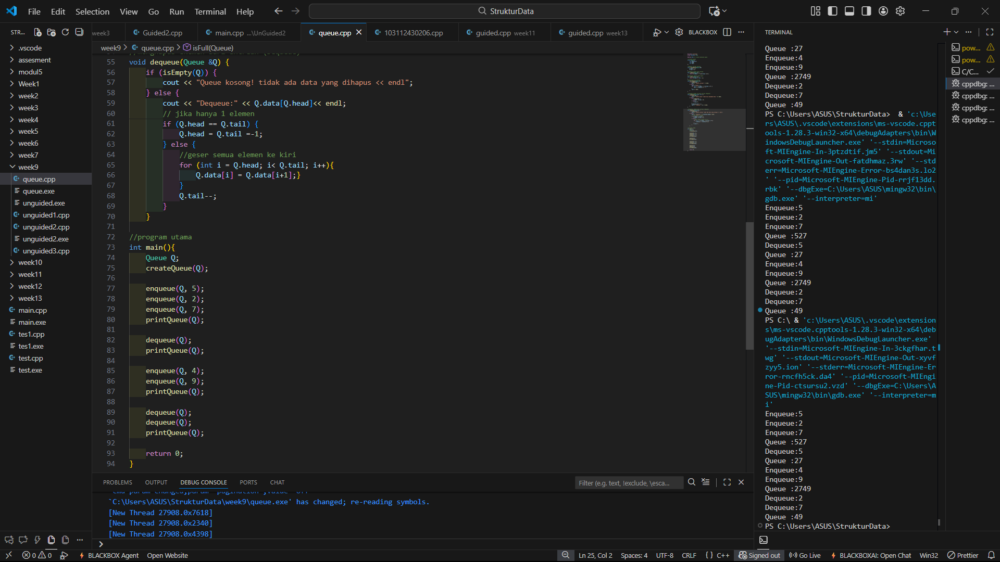
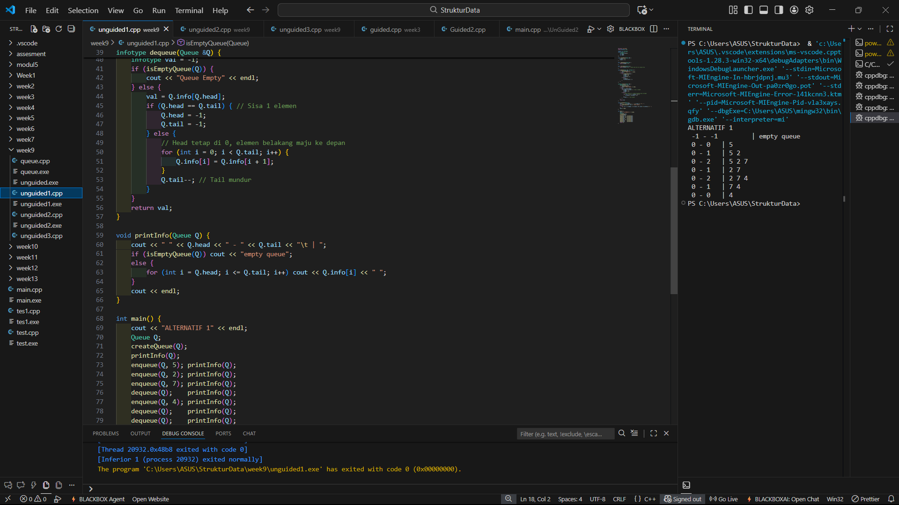

# <h1 align="center">Laporan Praktikum Modul 8 <br> Queue</h1>
<p align="center">DENNA WAHYU SETYOBUDI - 103112430206</p>

## Dasar Teori

Pada materi ini menjelaskan tentang Queue. Queue atau dalam bahasa Indonesia yang berarti antrean adalah struktur data yang menyusun elemen-elemen data dalam urutan linier. Prinsip dasar dari struktur data ini adalah “First In, First Out” (FIFO) yang berarti elemen data yang pertama dimasukkan ke dalam antrean akan menjadi yang pertama pula untuk dikeluarkan.

## Guided

### soal 1

```go
#include <iostream>
using namespace std;

#define MAX 5 // ukuran maksimal queue

//struktur queue
struct Queue {
    int data[MAX];
    int head;
    int tail;
};

//membuat antrean kososng
void createQueue(Queue &Q){
    Q.head = -1;
    Q.tail =-1;
}
//mengecek apakah queue kosong
bool isEmpty(Queue Q) {
    return (Q.head == -1 && Q.tail ==-1);
}
//menegecek apkaah queue penuh
bool isFull(Queue Q) {
    return (Q.tail == MAX - 1);
}
//menapilkan isi antrean
void printQueue(Queue Q) {
    if (isEmpty(Q)) {
        cout << "Queue kososng!" << endl;
    } else {
        cout <<"Queue :";
        for (int i = Q.head; i <= Q.tail; i++) {
            cout << Q.data[i] << "";
        }
        cout << endl;
    }
}

//menambah elemen ke dalam antrian (Enqueue)
void enqueue(Queue &Q, int x) {
    if (isFull(Q)) {
        cout << "Queue penuh! tidak bisa menambah data." << endl;
    } else {
        if (isEmpty(Q)) {
            Q.head = Q.tail = 0;
        } else {
            Q.tail++;
        }
        Q.data[Q.tail] = x;
        cout << "Enqueue:" <<x << endl;
    }
}

//menghapus ekemen dari antrean (Dequeue)
void dequeue(Queue &Q) {
    if (isEmpty(Q)) {
        cout << "Queue kosong! tidak ada data yang dihapus << endl";
    } else {
        cout << "Dequeue:" << Q.data[Q.head]<< endl;
        // jika hanya 1 elemen
        if (Q.head == Q.tail) {
            Q.head = Q.tail =-1;
        } else {
            //geser semua elemen ke kiri
            for (int i = Q.head; i< Q.tail; i++){
                Q.data[i] = Q.data[i+1];}
            }
            Q.tail--;
        } 
    }

//program utama 
int main(){
    Queue Q;
    createQueue(Q);

    enqueue(Q, 5);
    enqueue(Q, 2);
    enqueue(Q, 7);
    printQueue(Q);

    dequeue(Q);
    printQueue(Q);

    enqueue(Q, 4);
    enqueue(Q, 9);
    printQueue(Q);

    dequeue(Q);
    dequeue(Q);
    printQueue(Q);

    return 0;
}
```
> Output
> 

Pada perogram diatas kita harus membuat sebuah adt stack, kita membuat sebuah struck berisi data yang kita simpan serta pointer ke node berikutnya. Kita membuat fungsi isEmpty,push, pop dan show 

Lalu kita buat fungsi main nya kita buat pointer stack dan menginisialisasi stack kosong lalu menambahkan data dummy yaitu 10,20,30 ke stack menggunakan push lalu menampilkan stack lalu menghapus data teratas menggunakan pop lalu menampilkan stack 

## Unguided

### Soal 1

```go
#include <iostream>
using namespace std;

typedef int infotype;
struct Queue {
    infotype info[5];
    int head;
    int tail;
};

void createQueue(Queue &Q) {
    Q.head = -1;
    Q.tail = -1;
}

bool isEmptyQueue(Queue Q) {
    return Q.head == -1;
}

bool isFullQueue(Queue Q) {
    return Q.tail == 4; // Penuh jika tail di ujung array
}

void enqueue(Queue &Q, infotype x) {
    if (isFullQueue(Q)) {
        cout << "Queue Full" << endl;
    } else {
        if (isEmptyQueue(Q)) {
            Q.head = 0;
            Q.tail = 0;
            Q.info[0] = x;
        } else {
            Q.tail++;
            Q.info[Q.tail] = x;
        }
    }
}

infotype dequeue(Queue &Q) {
    infotype val = -1;
    if (isEmptyQueue(Q)) {
        cout << "Queue Empty" << endl;
    } else {
        val = Q.info[Q.head];
        if (Q.head == Q.tail) { // Sisa 1 elemen
            Q.head = -1;
            Q.tail = -1;
        } else {
            // Head tetap di 0, elemen belakang maju ke depan
            for (int i = 0; i < Q.tail; i++) {
                Q.info[i] = Q.info[i + 1];
            }
            Q.tail--; // Tail mundur
        }
    }
    return val;
}

void printInfo(Queue Q) {
    cout << " " << Q.head << " - " << Q.tail << "\t | ";
    if (isEmptyQueue(Q)) cout << "empty queue";
    else {
        for (int i = Q.head; i <= Q.tail; i++) cout << Q.info[i] << " ";
    }
    cout << endl;
}

int main() {
    cout << "ALTERNATIF 1" << endl;
    Queue Q;
    createQueue(Q);
    printInfo(Q);
    enqueue(Q, 5); printInfo(Q);
    enqueue(Q, 2); printInfo(Q);
    enqueue(Q, 7); printInfo(Q);
    dequeue(Q);    printInfo(Q);
    enqueue(Q, 4); printInfo(Q);
    dequeue(Q);    printInfo(Q);
    dequeue(Q);    printInfo(Q);
    return 0;
}
```

> Output
> 

Pada program di atas kita disuruh untuk membuat queue untuk alternatif 1 dimana head diam,tail bergerak. Kita membuat sebuah struck dimana kita Menyimpan data pada info[5], dengan head (depan) dan tail (belakang), buat fungsi createQueue, enqueue,dequeue, dan printQueue. cek apakah queue kosong atau full menggunakan boolean, pada alt ini queue dianggap penuh jika tail mencapai indeks terakhir (4). Untuk dequeue Saat data di head diambil, semua elemen yang tersisa di belakangnya digeser satu posisi ke kiri (maju). Head selalu tetap di indeks 0, dan tail berkurang 1.

lalu pada fungsi main kita jalankan data dummy.

### Soal 2

```go
#include <iostream>
using namespace std;

typedef int infotype;
struct Queue {
    infotype info[5];
    int head;
    int tail;
};

void createQueue(Queue &Q) {
    Q.head = -1;
    Q.tail = -1;
}

bool isEmptyQueue(Queue Q) {
    return Q.head == -1;
}

bool isFullQueue(Queue Q) {
    return Q.tail == 4; // Penuh jika tail di ujung array
}

void enqueue(Queue &Q, infotype x) {
    if (isFullQueue(Q)) {
        cout << "Queue Full" << endl;
    } else {
        if (isEmptyQueue(Q)) {
            Q.head = 0;
            Q.tail = 0;
            Q.info[0] = x;
        } else {
            Q.tail++;
            Q.info[Q.tail] = x;
        }
    }
}

infotype dequeue(Queue &Q) {
    infotype val = -1;
    if (isEmptyQueue(Q)) {
        cout << "Queue Empty" << endl;
    } else {
        val = Q.info[Q.head];
        if (Q.head == Q.tail) { // Sisa 1 elemen
            Q.head = -1;
            Q.tail = -1;
        } else {
            // Head tetap di 0, elemen belakang maju ke depan
            for (int i = 0; i < Q.tail; i++) {
                Q.info[i] = Q.info[i + 1];
            }
            Q.tail--; // Tail mundur
        }
    }
    return val;
}

void printInfo(Queue Q) {
    cout << " " << Q.head << " - " << Q.tail << "\t | ";
    if (isEmptyQueue(Q)) cout << "empty queue";
    else {
        for (int i = Q.head; i <= Q.tail; i++) cout << Q.info[i] << " ";
    }
    cout << endl;
}

int main() {
    cout << "ALTERNATIF 1" << endl;
    Queue Q;
    createQueue(Q);
    printInfo(Q);
    enqueue(Q, 5); printInfo(Q);
    enqueue(Q, 2); printInfo(Q);
    enqueue(Q, 7); printInfo(Q);
    dequeue(Q);    printInfo(Q);
    enqueue(Q, 4); printInfo(Q);
    dequeue(Q);    printInfo(Q);
    dequeue(Q);    printInfo(Q);
    return 0;
}
```

> Output
> 

Pada program di atas kita disuruh untuk membuat queue untuk alternatif 2 dimana head bergerak,tail bergerak. Kita membuat sebuah struck dimana kita Menyimpan data pada info[5], dengan head (depan) dan tail (belakang), buat fungsi createQueue, enqueue,dequeue, dan printQueue. cek apakah queue kosong atau full menggunakan boolean, pada alt ini queue dianggap penuh jika tail mencapai indeks terakhir (4). Untuk dequeue Data di head diambil, dan head langsung ditambah 1. Tidak ada pergeseran elemen.

lalu pada fungsi main kita jalankan data dummy.

### Soal 3

```go
#include <iostream>
using namespace std;

typedef int infotype;
struct Queue {
    infotype info[5];
    int head;
    int tail;
};

void createQueue(Queue &Q) {
    Q.head = -1;
    Q.tail = -1;
}

bool isEmptyQueue(Queue Q) {
    return Q.head == -1;
}

bool isFullQueue(Queue Q) {
    return Q.tail == 4; // Penuh jika tail di ujung array
}

void enqueue(Queue &Q, infotype x) {
    if (isFullQueue(Q)) {
        cout << "Queue Full" << endl;
    } else {
        if (isEmptyQueue(Q)) {
            Q.head = 0;
            Q.tail = 0;
            Q.info[0] = x;
        } else {
            Q.tail++;
            Q.info[Q.tail] = x;
        }
    }
}

infotype dequeue(Queue &Q) {
    infotype val = -1;
    if (isEmptyQueue(Q)) {
        cout << "Queue Empty" << endl;
    } else {
        val = Q.info[Q.head];
        if (Q.head == Q.tail) { // Sisa 1 elemen
            Q.head = -1;
            Q.tail = -1;
        } else {
            // Head tetap di 0, elemen belakang maju ke depan
            for (int i = 0; i < Q.tail; i++) {
                Q.info[i] = Q.info[i + 1];
            }
            Q.tail--; // Tail mundur
        }
    }
    return val;
}

void printInfo(Queue Q) {
    cout << " " << Q.head << " - " << Q.tail << "\t | ";
    if (isEmptyQueue(Q)) cout << "empty queue";
    else {
        for (int i = Q.head; i <= Q.tail; i++) cout << Q.info[i] << " ";
    }
    cout << endl;
}

int main() {
    cout << "ALTERNATIF 1" << endl;
    Queue Q;
    createQueue(Q);
    printInfo(Q);
    enqueue(Q, 5); printInfo(Q);
    enqueue(Q, 2); printInfo(Q);
    enqueue(Q, 7); printInfo(Q);
    dequeue(Q);    printInfo(Q);
    enqueue(Q, 4); printInfo(Q);
    dequeue(Q);    printInfo(Q);
    dequeue(Q);    printInfo(Q);
    return 0;
}
```

> Output
> 

Pada program di atas kita disuruh untuk membuat queue untuk alternatif 3 dimana head dan tail berputar. Kita membuat sebuah struck dimana kita Menyimpan data pada info[5], dengan head (depan) dan tail (belakang), buat fungsi createQueue, enqueue,dequeue, dan printQueue. cek apakah queue kosong atau full menggunakan boolean, pada alt ini queue dianggap penuh jika (tail + 1) % 5 sama dengan head. Untuk dequeue dan enqueue Pergerakan head dan tail menggunakan operasi modulo (% 5). Jika tail atau head mencapai batas array, mereka akan kembali ke indeks 0.

lalu pada fungsi main kita jalankan data dummy.

## Referensi

1.https://www.dicoding.com/blog/struktur-data-queue-pengertian-fungsi-dan-jenisnya/ (diakses /12/2025)

